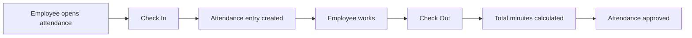
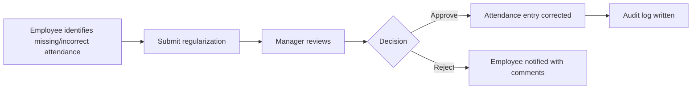
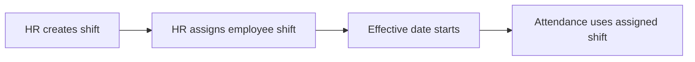

# Attendance Management Module

## 1. Module Purpose

The Attendance Management module tracks employee daily attendance, check-in/check-out, WFH/office/remote modes, shift assignment, attendance regularization, approval workflows, team attendance, and reports.

## 2. Roles and Permissions

| Role | Access |
| --- | --- |
| Super Admin | Full read/admin access |
| HR Admin | Full attendance administration, shifts, reports, overrides |
| Reporting Manager | Team attendance, team regularization approvals, team reports |
| Employee | Own attendance, check-in/check-out, own regularization requests |
| Trainer | Own attendance only |
| Compliance Officer | No default attendance access |

## 3. Backend Endpoints

| Method | Endpoint | Purpose |
| --- | --- | --- |
| GET | `/api/v1/attendance/entries` | Scoped attendance list |
| GET | `/api/v1/attendance/today` | Current employee/date attendance |
| GET | `/api/v1/attendance/stats` | Attendance summary statistics |
| POST | `/api/v1/attendance/check-in` | Employee check-in |
| POST | `/api/v1/attendance/check-out` | Employee check-out |
| GET | `/api/v1/attendance/regularizations` | Regularization request list |
| POST | `/api/v1/attendance/regularizations` | Submit regularization |
| PUT | `/api/v1/attendance/regularizations/:id` | Approve/reject regularization |
| GET | `/api/v1/attendance/shifts` | Shift master list |
| POST | `/api/v1/attendance/shifts` | Create shift |
| GET | `/api/v1/attendance/shift-assignments` | Shift assignment list |
| POST | `/api/v1/attendance/shift-assignments` | Assign employee shift |
| GET | `/api/v1/attendance/reports/daily` | Daily attendance report |

## 4. Check-In Payload

```json
{
  "mode": "OFFICE",
  "timestamp": "2026-06-20T09:30:00.000Z",
  "attendanceDate": "2026-06-20",
  "location": "Bengaluru"
}
```

## 5. Check-Out Payload

```json
{
  "timestamp": "2026-06-20T18:30:00.000Z",
  "attendanceDate": "2026-06-20"
}
```

## 6. Regularization Payload

```json
{
  "attendanceEntryId": 1,
  "attendanceDate": "2026-06-20",
  "reason": "Forgot checkout due to client call",
  "requestedCheckIn": "2026-06-20T09:30:00.000Z",
  "requestedCheckOut": "2026-06-20T18:30:00.000Z"
}
```

## 7. Regularization Decision Payload

```json
{
  "action": "APPROVE",
  "comments": "Approved after manager verification"
}
```

## 8. Shift Payload

```json
{
  "name": "General Shift",
  "startsAt": "09:30",
  "endsAt": "18:30",
  "graceMinutes": 10
}
```

## 9. Shift Assignment Payload

```json
{
  "employeeId": 1,
  "shiftId": 1,
  "effectiveFrom": "2026-06-01",
  "effectiveTo": null
}
```

## 10. Workflows

### 10.1 Daily Attendance



### 10.2 Attendance Regularization



### 10.3 Shift Assignment



## 11. Validation Rules

- One attendance entry is allowed per employee per attendance date.
- Check-in cannot be duplicated for the same employee/date.
- Check-out requires an existing check-in.
- Check-out timestamp must be after check-in timestamp.
- Regularization requires `attendanceDate` and `reason`.
- Rejected regularization requires comments.
- Shift requires `name`, `startsAt`, and `endsAt`.
- Shift assignment requires valid employee, shift, and effective date.
- Employee can access only own attendance.
- Manager can access team attendance only.
- HR Admin can access organization attendance.

## 12. Response Examples

### Attendance Stats

```json
{
  "data": {
    "total": 30,
    "office": 22,
    "wfh": 8,
    "remote": 0,
    "missingCheckout": 6,
    "pendingRegularizations": 2,
    "approved": 24,
    "submitted": 6
  }
}
```

### Attendance Entry

```json
{
  "data": {
    "id": 1,
    "employeeId": 1,
    "employeeName": "Aakansha Yadav",
    "attendanceDate": "2026-06-20",
    "mode": "OFFICE",
    "checkIn": "2026-06-20T09:30:00.000Z",
    "checkOut": "2026-06-20T18:30:00.000Z",
    "totalMinutes": 540,
    "status": "APPROVED"
  }
}
```

## 13. UI Screens

- My Attendance
- Today Attendance Card
- Check-In/Check-Out Actions
- Monthly Attendance Calendar
- Attendance Regularization Form
- Manager Team Attendance
- Regularization Approval Queue
- HR Attendance Admin
- Shift Master
- Shift Assignment
- Daily Attendance Report

## 14. Audit Events

- `ATTENDANCE_CHECK_IN`
- `ATTENDANCE_CHECK_OUT`
- `CREATE attendance_regularizations`
- `APPROVE attendance_regularizations`
- `REJECT attendance_regularizations`
- `CREATE shifts`
- `CREATE shift_assignments`

## 15. Scalability Notes

- Attendance list endpoints are paginated.
- Attendance reports filter by date range, employee, mode, and status.
- Database indexes exist for employee/date and attendance date.
- For larger scale, monthly partitioning can be added to `attendance_entries`.
