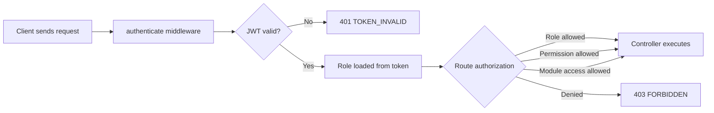

# Authentication and RBAC Module

This document defines the HRMS Authentication and Role-Based Access Control module.

## 1. Module Scope

- Email/password login.
- JWT access tokens.
- Refresh token rotation.
- Logout and token revocation.
- Current session profile.
- Role-to-permission catalog.
- Role-to-module access matrix.
- API middleware authorization.
- UI module visibility support.

## 2. Roles

| Role | Purpose |
| --- | --- |
| `SUPER_ADMIN` | Platform configuration, override, audit, RBAC oversight |
| `HR_ADMIN` | HR lifecycle administration and HR reports |
| `REPORTING_MANAGER` | Team approvals, team reports, probation/performance reviews |
| `EMPLOYEE` | Self-service workflows and own records |
| `TRAINER` | Training sessions, attendance, completion, certificates |
| `COMPLIANCE_OFFICER` | Policies, certifications, compliance tasks and reports |

## 3. Permission Catalog

| Permission | Purpose |
| --- | --- |
| `auth.session.read` | Read own session |
| `rbac.read` | View RBAC roles, permissions, matrix |
| `rbac.manage` | Manage RBAC configuration in future persistent model |
| `audit.read` | View audit logs |
| `report.export` | Export reports |
| `approval.override` | Override workflow approvals |
| `employee.self.read` | Read own employee profile/self-service data |
| `employee.self.write` | Update own self-service requests |
| `team.read` | Read assigned team data |
| `team.approve` | Approve assigned team workflows |

## 4. Token Model

| Token | Default TTL | Purpose |
| --- | --- | --- |
| Access token | 15 minutes | Authorizes API calls |
| Refresh token | 7 days | Rotates session and issues new tokens |

Access token claims:

```json
{
  "sub": "u-hr-admin",
  "role": "HR_ADMIN",
  "name": "Doris Anna T",
  "email": "hr.admin@cuculus.example",
  "employeeId": 11
}
```

## 5. API Endpoints

| Method | Endpoint | Purpose |
| --- | --- | --- |
| POST | `/api/v1/auth/login` | Login and issue tokens |
| POST | `/api/v1/auth/refresh` | Rotate refresh token |
| POST | `/api/v1/auth/logout` | Revoke refresh token |
| GET | `/api/v1/auth/me` | Current user and access |
| GET | `/api/v1/auth/permissions` | Current user's permissions |
| GET | `/api/v1/rbac/me` | Current role, permissions, modules |
| GET | `/api/v1/rbac/roles` | Role definitions |
| GET | `/api/v1/rbac/permissions` | Permission catalog |
| GET | `/api/v1/rbac/matrix` | Role-module permission matrix |

## 6. Backend Files

| File | Purpose |
| --- | --- |
| `backend/src/config/rbac.js` | Permission catalog and role permission matrix |
| `backend/src/middleware/auth.js` | Authentication, role checks, permission checks, module checks |
| `backend/src/routes/auth.js` | Login, refresh, logout, current session |
| `backend/src/routes/rbac.js` | RBAC inspection endpoints |
| `backend/src/config/modules.js` | Module-level read/write role access |

## 7. Authorization Flow



## 8. RBAC Rules

- API middleware is the source of truth for authorization.
- Frontend module visibility must use `/api/v1/auth/me`, `/api/v1/auth/permissions`, or `/api/v1/rbac/me`.
- Module read/write access is computed from `moduleCatalog`.
- General permissions are computed from `rolePermissions`.
- HR Admin, Compliance Officer, and Super Admin can view RBAC matrix.
- Employee can only view own access.
- Permission changes must be made centrally in `backend/src/config/rbac.js` and `backend/src/config/modules.js`.

## 9. Error Responses

Missing token:

```json
{
  "error": {
    "code": "TOKEN_MISSING",
    "message": "Missing access token",
    "details": []
  }
}
```

Forbidden module:

```json
{
  "error": {
    "code": "FORBIDDEN_MODULE",
    "message": "Insufficient permissions for Employee Master",
    "details": []
  }
}
```

Forbidden permission:

```json
{
  "error": {
    "code": "FORBIDDEN_PERMISSION",
    "message": "Missing permission: rbac.read",
    "details": []
  }
}
```

## 10. Future Production Enhancements

- Persist roles and permissions in `roles`, `permissions`, and `role_permissions` tables.
- Add password reset and MFA.
- Store refresh token hashes in PostgreSQL instead of memory.
- Add login attempt throttling.
- Add device/session management screen.
- Add audit events for every auth and RBAC action.
