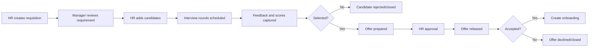
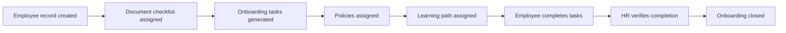
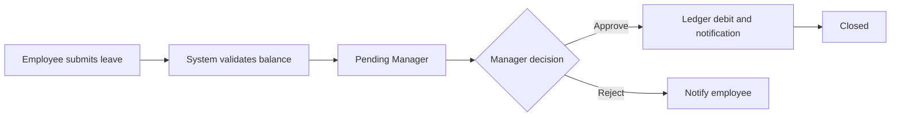
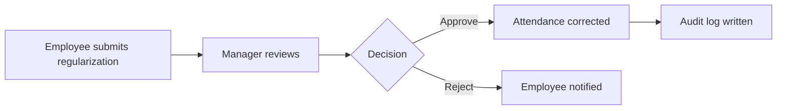
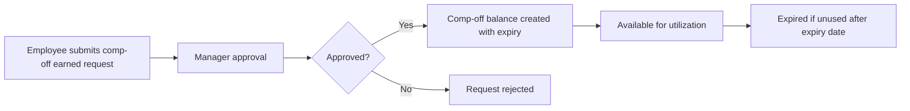
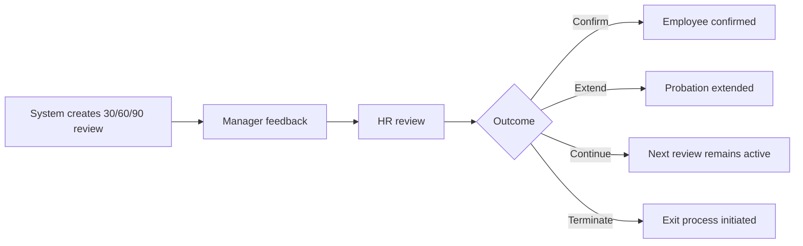
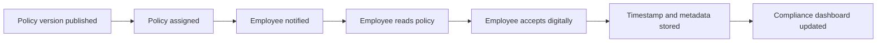
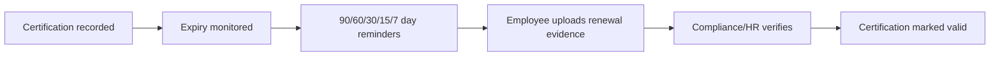
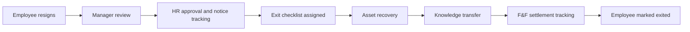

# HRMS BRD and Functional Requirement Specification

## Document Control

| Item | Value |
| --- | --- |
| Product | Enterprise HRMS |
| Organization Size | 50 employees, scalable to 500+ employees |
| Document Type | Business Requirements Document and Functional Requirement Specification |
| Technology Stack | Next.js, TypeScript, Tailwind CSS, Node.js, Express, PostgreSQL, JWT, S3-compatible storage, Docker, Nginx |
| Roles Covered | Super Admin, HR Admin, Reporting Manager, Employee, Trainer, Compliance Officer |
| Source of Truth | `docs/PROJECT_MEMORY.md`, `backend/database/schema.sql`, `docs/API_DESIGN.md` |

## 1. Executive Summary

The Enterprise HRMS is a cloud-based Human Resource Management System designed to manage the complete employee lifecycle from pre-hire to exit. The platform will centralize employee records, attendance, leave, comp-off, probation, performance, learning, policies, certifications, self-service, manager workflows, HR analytics, compliance, notifications, audit logs, and reports.

The system must support current business operations for 50 employees while scaling to 500+ employees without redesigning core architecture, database schema, or role-based access controls.

## 2. Business Objectives

- Digitize the full employee lifecycle from candidate management to full and final settlement.
- Provide a single source of truth for employee master data and lifecycle history.
- Reduce manual HR operations through workflows, automated reminders, dashboards, and exports.
- Enable employees to complete HR tasks independently through self-service.
- Enable managers to review team attendance, leave, probation, performance, and compliance.
- Ensure policy acknowledgement, certification expiry, and statutory compliance are tracked.
- Maintain secure, auditable, role-based access for all sensitive HR data.

## 3. Business Scope

### 3.1 In Scope

- Candidate management, interviews, offers, and recruitment tracking.
- Employee creation, onboarding tasks, document collection, policy assignment, learning path assignment.
- Employee master, departments, designations, reporting hierarchy, documents, directory, and org chart.
- Attendance tracking, check-in/check-out, WFH, regularization, shift assignment, and reports.
- Leave management for Casual Leave, Sick Leave, Earned Leave, Comp-Off, holidays, accruals, balances, and approvals.
- Probation reviews at 30, 60, and 90 days.
- Goals, KPIs, reviews, feedback, and annual assessments.
- Training calendar, mandatory/department trainings, attendance, completion, and certificates.
- Policy repository, version control, assignments, acknowledgements, compliance dashboard, and reminders.
- Employee certifications, expiry tracking, and renewal reminders.
- Employee self-service and manager portal.
- HR dashboard and all listed reports.
- Exit management with resignation, notice period, checklist, asset recovery, knowledge transfer, and full/final settlement tracking.
- RBAC, audit logs, activity tracking, notifications, search, filters, Excel export, PDF export, and mobile responsive UI.

### 3.2 Out of Scope for Initial Release

- Payroll calculation and statutory payroll filings.
- Biometric device integration.
- Third-party job board posting integrations.
- Advanced AI resume screening.
- Native mobile apps.
- Multi-country payroll and tax compliance.

## 4. Stakeholders and Personas

| Role | Description | Primary Goals |
| --- | --- | --- |
| Super Admin | Platform owner | Configure roles, monitor audit logs, manage system-level settings |
| HR Admin | HR operations owner | Manage employee lifecycle, policies, leave rules, onboarding, exits, reports |
| Reporting Manager | Team owner | Approve team workflows, review probation, performance, attendance, compliance |
| Employee | Self-service user | Manage profile, leave, attendance requests, trainings, documents, policies |
| Trainer | Learning owner | Create trainings, mark attendance, update completions, issue certificates |
| Compliance Officer | Compliance owner | Track policies, acknowledgements, certifications, statutory tasks, evidence |

## 5. Assumptions and Constraints

- PostgreSQL is the system of record.
- Files are stored in S3-compatible object storage; PostgreSQL stores metadata and object keys.
- All protected APIs use JWT access tokens and refresh token rotation.
- All module access is controlled by RBAC at both UI and API layers.
- All critical changes and approvals are auditable.
- One employee has one active reporting manager at a time.
- All future modules must reuse approved workflow, notification, audit, and employee master patterns.

## 6. Role-Based Access Overview

| Module | Super Admin | HR Admin | Reporting Manager | Employee | Trainer | Compliance Officer |
| --- | --- | --- | --- | --- | --- | --- |
| System Configuration | Full | Limited | No | No | No | No |
| Recruitment | View | Full | Create/Review | No | No | No |
| Onboarding | View | Full | Review Tasks | Own Tasks | Training Tasks | Compliance Tasks |
| Employee Master | View | Full | Team View | Own Profile | Limited | Compliance View |
| Attendance | View | Full | Team Approval | Own Request | Own View | No |
| Leave | View | Full | Team Approval | Own Request | Own Request | No |
| Comp-Off | View | Full | Team Approval | Own Request | Own Request | No |
| Probation | View | Full | Team Review | No | No | No |
| Performance | View | Full | Team Review | Self Review | No | No |
| Learning | View | Configure | Team Compliance | Attend | Full | Compliance View |
| Policies | View | Full | Team Compliance | Acknowledge | Acknowledge | Full |
| Certifications | View | Full | Team View | Own Upload | Own Upload | Full |
| Exit | View | Full | Team Review | Own Resignation | No | Compliance View |
| Reports | Full | Full | Team Reports | Own Data | Training Reports | Compliance Reports |

## 7. Functional Requirements

### 7.1 Authentication and User Management

| ID | Requirement |
| --- | --- |
| AUTH-001 | Users must authenticate using email and password. |
| AUTH-002 | System must issue short-lived JWT access tokens and refresh tokens. |
| AUTH-003 | Refresh tokens must be rotatable and revocable. |
| AUTH-004 | Users must only access modules allowed by their role. |
| AUTH-005 | Inactive users must not be allowed to authenticate. |
| AUTH-006 | Logout must invalidate the active refresh token. |
| AUTH-007 | Failed login attempts must be auditable. |

### 7.2 Pre-Hire Management

| ID | Requirement |
| --- | --- |
| REC-001 | HR Admin must create requisitions with title, department, designation, openings, hiring manager, target joining date, and status. |
| REC-002 | Reporting Manager must be able to provide hiring inputs on assigned requisitions. |
| REC-003 | HR Admin must create candidate profiles with contact details, source, resume, stage, and rating. |
| REC-004 | System must track candidate interview rounds, interviewer, schedule, score, feedback, and status. |
| REC-005 | HR Admin must create offer records with offered compensation, joining date, approval status, and acceptance status. |
| REC-006 | Accepted offers must be convertible into onboarding employee records without duplicate candidate data. |

### 7.3 Onboarding

| ID | Requirement |
| --- | --- |
| ONB-001 | HR Admin must create employee records from accepted offers or directly from employee creation. |
| ONB-002 | System must generate onboarding tasks by role, department, location, and designation. |
| ONB-003 | System must support document collection checklists. |
| ONB-004 | System must assign policies and learning paths during onboarding. |
| ONB-005 | Employees must see and complete their assigned onboarding tasks. |
| ONB-006 | HR Admin must track onboarding completion and overdue tasks. |

### 7.4 Employee Management

| ID | Requirement |
| --- | --- |
| EMP-001 | HR Admin must manage employee master data. |
| EMP-002 | System must maintain departments and designations as master data. |
| EMP-003 | System must maintain reporting hierarchy and organization chart. |
| EMP-004 | System must store employee documents as metadata linked to S3 object keys. |
| EMP-005 | Employees must request profile updates through self-service. |
| EMP-006 | Reporting Manager must see team employee profiles with limited sensitive fields. |
| EMP-007 | System must track job history for department, designation, manager, and effective dates. |

### 7.5 Attendance Management

| ID | Requirement |
| --- | --- |
| ATT-001 | Employees must check in and check out for each working day. |
| ATT-002 | System must support attendance modes: office, WFH, remote, client site, holiday, leave, absent. |
| ATT-003 | System must enforce one attendance entry per employee per date. |
| ATT-004 | HR Admin must assign shifts with start time, end time, and grace period. |
| ATT-005 | Employees must submit attendance regularization requests for missing or incorrect entries. |
| ATT-006 | Reporting Manager must approve or reject team regularization requests. |
| ATT-007 | HR Admin must generate attendance reports with filters and exports. |

### 7.6 Leave Management

| ID | Requirement |
| --- | --- |
| LEV-001 | System must support Casual Leave, Sick Leave, Earned Leave, and Comp-Off. |
| LEV-002 | HR Admin must configure leave type quota, paid/unpaid flag, document requirement, and active status. |
| LEV-003 | HR Admin must configure leave accrual rules. |
| LEV-004 | Employees must submit full-day or half-day leave requests. |
| LEV-005 | System must validate leave balance before submission unless HR override is used. |
| LEV-006 | Approved leave must debit the leave ledger and update balance. |
| LEV-007 | Cancelled approved leave must reverse the ledger after approval. |
| LEV-008 | HR Admin must maintain location-wise holiday calendars. |
| LEV-009 | Reporting Manager must approve or reject team leave requests. |

### 7.7 Comp-Off Management

| ID | Requirement |
| --- | --- |
| COF-001 | Employees must submit comp-off requests with source work date, earned days, reason, and expiry date. |
| COF-002 | Reporting Manager must approve or reject comp-off requests. |
| COF-003 | Approved comp-off must be available for utilization in leave workflows. |
| COF-004 | Expired comp-off must not be available for utilization. |
| COF-005 | System must track earned, utilized, remaining, and expired comp-off balances. |

### 7.8 Probation Management

| ID | Requirement |
| --- | --- |
| PRO-001 | System must generate probation review records for 30, 60, and 90 days from joining date. |
| PRO-002 | Reporting Manager must submit feedback and recommendation. |
| PRO-003 | HR Admin must confirm, extend, continue, or terminate probation based on recommendation. |
| PRO-004 | Extension must require reason and revised end date. |
| PRO-005 | Probation status must appear in HR dashboard and Manager Portal. |

### 7.9 Performance Management

| ID | Requirement |
| --- | --- |
| PER-001 | HR Admin must create performance cycles. |
| PER-002 | Employees and managers must define goals and KPIs. |
| PER-003 | Employees must submit self-review comments. |
| PER-004 | Reporting Manager must provide feedback and rating. |
| PER-005 | HR Admin must close review cycles and generate assessment reports. |

### 7.10 Learning and Development

| ID | Requirement |
| --- | --- |
| LND-001 | HR Admin or Trainer must create trainings with category, audience, mandatory flag, and owner. |
| LND-002 | Trainer must create training sessions with trainer, start/end time, location, and meeting URL. |
| LND-003 | System must assign mandatory trainings by employee, department, designation, or audience rule. |
| LND-004 | Trainer must mark attendance and completion. |
| LND-005 | System must track training completion and certificates. |
| LND-006 | Manager Portal must show team training compliance. |

### 7.11 Policy Management and Acknowledgement

| ID | Requirement |
| --- | --- |
| POL-001 | HR Admin or Compliance Officer must create policies by category and owner. |
| POL-002 | System must maintain policy versions with version number, effective date, review date, expiry date, and file/body. |
| POL-003 | Policy versions must be assignable to employees, departments, or designations. |
| POL-004 | Employees must digitally acknowledge assigned policies. |
| POL-005 | Acknowledgement must capture employee, assignment, timestamp, IP address, and user-agent where available. |
| POL-006 | Compliance dashboard must show acknowledged, pending, overdue, and expired policies. |

### 7.12 Certification Management

| ID | Requirement |
| --- | --- |
| CER-001 | Employees, HR Admin, or Compliance Officer must add certification records. |
| CER-002 | Certification must track name, issuer, issued date, expiry date, evidence file, and status. |
| CER-003 | System must send renewal reminders before expiry. |
| CER-004 | Compliance Officer must see expiring and expired certifications. |

### 7.13 Employee Self Service

| ID | Requirement |
| --- | --- |
| ESS-001 | Employees must view their profile, documents, leave balance, attendance, trainings, policies, and certifications. |
| ESS-002 | Employees must submit leave, comp-off, attendance regularization, profile update, document upload, and resignation requests. |
| ESS-003 | Employees must view approval status and comments for submitted requests. |
| ESS-004 | Employees must download permitted documents and reports related to themselves. |

### 7.14 Manager Portal

| ID | Requirement |
| --- | --- |
| MGR-001 | Reporting Manager must see team attendance summary. |
| MGR-002 | Reporting Manager must approve or reject team leave, comp-off, and attendance regularization. |
| MGR-003 | Reporting Manager must complete probation reviews. |
| MGR-004 | Reporting Manager must view team training and policy compliance. |
| MGR-005 | Reporting Manager must provide team performance feedback. |

### 7.15 HR Dashboard and Reports

| ID | Requirement |
| --- | --- |
| REP-001 | HR Dashboard must show headcount, attrition, new joiners, attendance analytics, leave analytics, probation status, training compliance, and policy compliance. |
| REP-002 | System must generate attendance, leave, headcount, attrition, probation, training, policy compliance, and certification reports. |
| REP-003 | Reports must support filters by date range, department, location, manager, status, and employee. |
| REP-004 | Reports must support Excel export. |
| REP-005 | Reports must support PDF export. |

### 7.16 Exit Management

| ID | Requirement |
| --- | --- |
| EXT-001 | Employee or HR Admin must initiate resignation workflow. |
| EXT-002 | System must track resignation date, requested last working day, approved last working day, reason, and status. |
| EXT-003 | Reporting Manager must review resignation and notice period. |
| EXT-004 | HR Admin must create exit checklist items. |
| EXT-005 | System must track asset recovery, knowledge transfer, and full/final settlement status. |
| EXT-006 | Exit closure must update employee lifecycle status to `EXITED`. |

## 8. User Stories

### 8.1 Super Admin

- As a Super Admin, I want to manage platform-level roles so that users get only the access they need.
- As a Super Admin, I want to view audit logs so that critical activity can be reviewed.
- As a Super Admin, I want to override workflows with reason capture so that exceptional cases are controlled and auditable.

### 8.2 HR Admin

- As an HR Admin, I want to create a requisition so that hiring requirements can be tracked.
- As an HR Admin, I want to convert an accepted offer into onboarding so that new hire setup is seamless.
- As an HR Admin, I want to create employee records so that employee master data is centralized.
- As an HR Admin, I want to configure leave and holiday rules so that employee leave balances are accurate.
- As an HR Admin, I want to assign policies and trainings so that compliance obligations are fulfilled.
- As an HR Admin, I want to manage exits so that separation activities are completed before closure.
- As an HR Admin, I want to export reports so that HR analytics can be shared with leadership.

### 8.3 Reporting Manager

- As a Reporting Manager, I want to approve team leave requests so that staffing is controlled.
- As a Reporting Manager, I want to approve attendance regularization so that attendance records are accurate.
- As a Reporting Manager, I want to complete probation reviews so that employee confirmation decisions are timely.
- As a Reporting Manager, I want to review team training compliance so that mandatory learning is completed.
- As a Reporting Manager, I want to provide performance feedback so that assessments are completed.

### 8.4 Employee

- As an Employee, I want to view and update my profile so that my personal details remain current.
- As an Employee, I want to submit leave and comp-off requests so that time-off approvals are tracked.
- As an Employee, I want to regularize attendance so that missing entries can be corrected.
- As an Employee, I want to acknowledge policies digitally so that compliance is recorded.
- As an Employee, I want to access assigned trainings so that I can complete mandatory learning.
- As an Employee, I want to upload documents and certifications so that HR records are complete.
- As an Employee, I want to initiate resignation so that exit formalities can begin.

### 8.5 Trainer

- As a Trainer, I want to schedule training sessions so that employees can attend learning programs.
- As a Trainer, I want to mark attendance so that completion records are accurate.
- As a Trainer, I want to issue or upload certificates so that training evidence is maintained.

### 8.6 Compliance Officer

- As a Compliance Officer, I want to manage compliance tasks so that obligations are tracked.
- As a Compliance Officer, I want to monitor policy acknowledgements so that overdue employees are followed up.
- As a Compliance Officer, I want to track expiring certifications so that renewals happen on time.
- As a Compliance Officer, I want evidence files linked to compliance tasks so that audits can be supported.

## 9. Workflows

### 9.1 Recruitment to Offer Workflow

### 9.2 Onboarding Workflow

### 9.3 Leave Approval Workflow

### 9.4 Attendance Regularization Workflow

### 9.5 Comp-Off Workflow

### 9.6 Probation Workflow

### 9.7 Policy Acknowledgement Workflow

### 9.8 Certification Renewal Workflow

### 9.9 Exit Workflow

## 10. Approval Matrices

### 10.1 Workflow Approval Matrix

| Workflow | Initiator | Level 1 Approver | Level 2 Approver | Final Owner | Override Role |
| --- | --- | --- | --- | --- | --- |
| Requisition | HR Admin / Manager | Reporting Manager | HR Admin | HR Admin | Super Admin |
| Offer | HR Admin | HR Admin | Super Admin if exception | HR Admin | Super Admin |
| Employee Creation | HR Admin | HR Admin | None | HR Admin | Super Admin |
| Profile Update | Employee | HR Admin | None | HR Admin | Super Admin |
| Leave Request | Employee | Reporting Manager | HR Admin for override | Reporting Manager | HR Admin / Super Admin |
| Attendance Regularization | Employee | Reporting Manager | HR Admin for exception | Reporting Manager | HR Admin |
| Comp-Off Request | Employee | Reporting Manager | HR Admin for exception | Reporting Manager | HR Admin |
| Probation Review | System / HR Admin | Reporting Manager | HR Admin | HR Admin | Super Admin |
| Performance Review | Employee / Manager | Reporting Manager | HR Admin cycle closure | HR Admin | Super Admin |
| Training Completion | Trainer | HR Admin if mandatory exception | None | Trainer | HR Admin |
| Policy Publication | HR Admin / Compliance Officer | Compliance Officer | HR Admin | Compliance Officer | Super Admin |
| Policy Acknowledgement | Employee | Auto-recorded | Compliance Officer monitors | Employee | Compliance Officer |
| Certification Verification | Employee | Compliance Officer | HR Admin if disputed | Compliance Officer | Super Admin |
| Resignation | Employee | Reporting Manager | HR Admin | HR Admin | Super Admin |
| Exit Closure | HR Admin | Reporting Manager for KT | HR Admin | HR Admin | Super Admin |

### 10.2 Decision Actions

| Action | Allowed For | Required Inputs |
| --- | --- | --- |
| Submit | Initiator | Entity details |
| Approve | Assigned approver | Comments optional unless configured |
| Reject | Assigned approver | Rejection reason mandatory |
| Send Back | Assigned approver | Clarification comments mandatory |
| Cancel | Initiator before approval / HR Admin | Cancellation reason |
| Override | HR Admin / Super Admin | Override reason mandatory |
| Close | Final owner | Completion confirmation |

## 11. Notification Requirements

### 11.1 Notification Channels

- In-app notifications.
- Email notifications.
- Dashboard alerts.
- Reminder queues for scheduled notifications.

### 11.2 Notification Matrix

| Event | Recipient | Channel | Trigger |
| --- | --- | --- | --- |
| Login security alert | User | Email/In-App | Suspicious or new login pattern |
| Requisition created | Hiring Manager | In-App | Requisition assigned |
| Interview scheduled | Interviewer, HR Admin | Email/In-App | Interview record created |
| Offer pending approval | HR Admin | In-App | Offer submitted |
| Onboarding task assigned | Task owner | Email/In-App | Task generated |
| Onboarding overdue | HR Admin, Task owner | Email/In-App/Dashboard | Due date missed |
| Document uploaded | HR Admin | In-App | Employee upload completed |
| Document expiring | Employee, HR Admin | Email/In-App | 90/60/30/15/7 days before expiry |
| Leave submitted | Reporting Manager | Email/In-App | Leave request submitted |
| Leave approved/rejected | Employee | Email/In-App | Approval decision |
| Attendance missing checkout | Employee | In-App | End of day job |
| Attendance regularization submitted | Reporting Manager | Email/In-App | Request submitted |
| Comp-off expiring | Employee | Email/In-App | Before expiry date |
| Probation review due | Reporting Manager, HR Admin | Email/In-App/Dashboard | 7 days before due date |
| Training assigned | Employee | Email/In-App | Assignment created |
| Training overdue | Employee, Manager | Email/In-App/Dashboard | Due date missed |
| Policy assigned | Employee | Email/In-App | Assignment created |
| Policy acknowledgement overdue | Employee, Manager, Compliance Officer | Email/In-App/Dashboard | Due date missed |
| Certification expiring | Employee, Compliance Officer | Email/In-App/Dashboard | 90/60/30/15/7 days before expiry |
| Resignation submitted | Reporting Manager, HR Admin | Email/In-App | Resignation created |
| Exit checklist overdue | HR Admin, Owner | Email/In-App/Dashboard | Due date missed |
| Report exported | Requesting user | In-App | Export completed |

### 11.3 Notification Rules

- Notifications must include title, body, recipient, link, read status, and created timestamp.
- Email notifications must be queued before delivery.
- Failed email attempts must be retried and tracked.
- Users must be able to mark in-app notifications as read.
- Reminder notifications must not create duplicate active reminders for the same event/date.

## 12. Security Requirements

### 12.1 Authentication and Session Security

- Passwords must be hashed using a secure hashing algorithm.
- Access tokens must be short-lived.
- Refresh tokens must be rotatable, revocable, and hashed in persistent storage.
- Logout must revoke refresh token sessions.
- Inactive users must be blocked.
- Production secrets must never be committed to source control.

### 12.2 Authorization

- RBAC must be enforced in API middleware.
- UI navigation must hide inaccessible modules.
- API must remain authoritative even if UI is bypassed.
- Employee users must only access their own self-service records unless explicitly permitted.
- Managers must only access direct/assigned team data.
- Compliance Officers must not access unrelated compensation data unless explicitly granted.

### 12.3 Data Protection

- Sensitive employee fields must be masked or hidden based on role.
- File downloads must use secure, time-bound access patterns.
- S3 buckets must be private.
- Audit logs must not store plaintext passwords, tokens, or secrets.
- Production traffic must use HTTPS.
- Database access must use least-privilege credentials.

### 12.4 Audit and Activity Tracking

- System must audit login, logout, failed login, create, update, delete, approval, rejection, override, upload, download, and export events.
- Audit records must include actor, action, entity type, entity id, timestamp, and old/new values where applicable.
- Override actions must require reason capture.
- Soft-deleted records must retain auditability.

### 12.5 Operational Security

- Docker images must not contain development secrets.
- Environment variables must be used for credentials.
- Backend must validate request payloads and file metadata.
- API responses must not expose stack traces in production.
- Rate limiting should be applied to authentication and export endpoints in production.

## 13. Compliance Requirements

### 13.1 HR and Policy Compliance

- Policies must maintain version number, effective date, review date, expiry date, owner, and status.
- Employees must digitally acknowledge assigned policies.
- Policy acknowledgement must record timestamp and device/request metadata where available.
- Compliance dashboard must show pending, completed, overdue, and expired policy items.
- Policy changes must not overwrite previous policy versions.

### 13.2 Certification Compliance

- Certifications must track issuer, issue date, expiry date, evidence, and status.
- Renewal reminders must be generated before 90, 60, 30, 15, and 7 days.
- Expired certifications must be visible to Compliance Officer and HR Admin.
- Renewal evidence must be stored as document metadata linked to S3 storage.

### 13.3 Records and Retention

- Employee records must not be hard-deleted except under approved legal purge.
- Documents must retain upload metadata.
- Audit logs must be retained according to organizational policy.
- Exit records must preserve checklist, asset, KT, and settlement status history.

### 13.4 Reporting Compliance

- Reports must respect role-based data access.
- Export actions must be auditable.
- Compliance reports must support date range, department, manager, employee, and status filters.
- PDF and Excel exports must include report title, generated timestamp, and requesting user.

## 14. Data Requirements

### 14.1 Master Data

- Users and roles.
- Employees.
- Departments.
- Designations.
- Reporting hierarchy.
- Leave types.
- Leave accrual rules.
- Holiday calendars.
- Shifts.
- Policies and versions.
- Training categories.

### 14.2 Transactional Data

- Requisitions, candidates, interviews, offers.
- Onboarding tasks.
- Attendance entries and regularizations.
- Leave requests, balances, and ledger.
- Comp-off requests and utilization.
- Probation reviews.
- Goals, KPIs, performance reviews.
- Training sessions, assignments, attendance.
- Policy assignments and acknowledgements.
- Certifications.
- Compliance tasks.
- Resignations, exit checklist, asset recovery, KT, F&F settlement.
- Notifications, email queue, approval actions, audit logs.

## 15. Search, Filter, and Export Requirements

- All major list pages must support search.
- Lists must support pagination.
- Lists must support status filters.
- Report pages must support date range filters.
- Employee-based reports must support department, location, manager, and employee filters.
- Exports must support Excel and PDF.
- Export permissions must follow report access rules.

## 16. UI/UX Requirements

- UI must be mobile responsive.
- Sidebar/navigation must be role-aware.
- Dashboards must use cards, charts, alerts, and actionable queues.
- Tables must support search, filters, pagination, and exports.
- Workflow detail pages must show timeline, comments, status, owner, and next action.
- Forms must validate required fields before submission.
- Status labels must use consistent colors across modules.
- Employee self-service pages must be simple and action-oriented.

## 17. Non-Functional Requirements

| Category | Requirement |
| --- | --- |
| Performance | Standard list pages should load within acceptable business response time for 500+ employees. |
| Scalability | Stateless backend must support horizontal scaling. |
| Availability | Application must run behind Nginx and support containerized deployment. |
| Maintainability | Modules must reuse common RBAC, approval, notification, audit, and export patterns. |
| Reliability | Email notifications must use queue-based delivery and retry attempts. |
| Usability | System must support desktop, tablet, and mobile layouts. |
| Observability | Errors, audit events, and key workflow actions must be logged. |
| Backup | PostgreSQL data must be backed up in production. |

## 18. Acceptance Criteria

- All six user roles can authenticate and access only permitted modules.
- HR Admin can manage complete employee lifecycle from pre-hire to exit.
- Reporting Manager can approve team leave, attendance regularization, comp-off, probation, and performance workflows.
- Employee can submit self-service requests and track status.
- Trainer can manage training sessions, attendance, completion, and certificates.
- Compliance Officer can manage policy, certification, and compliance dashboards.
- Policy acknowledgement captures employee, policy version, timestamp, and metadata.
- Leave approval updates leave ledger and balance.
- Comp-off expiry and utilization are tracked.
- Probation reviews are generated and tracked for 30, 60, and 90 days.
- Reports support search, filters, Excel export, and PDF export.
- Audit logs are created for critical actions.
- No duplicate tables or duplicate module functionality are introduced.

## 19. Traceability Matrix

| Business Need | Supporting Modules |
| --- | --- |
| Complete employee lifecycle | Recruitment, Onboarding, Employee Master, Probation, Performance, Exit |
| Time and availability management | Attendance, Leave, Comp-Off, Holiday Calendar, Shifts |
| Compliance readiness | Policy Management, Policy Acknowledgement, Certifications, Compliance Tasks, Audit Logs |
| Employee empowerment | Employee Self Service, Documents, Leave, Attendance, Trainings, Policies |
| Manager accountability | Manager Portal, Approval Queue, Team Reports |
| HR analytics | HR Dashboard, Reports, Exports |
| Secure operations | RBAC, JWT, Refresh Tokens, Audit Logs, S3 Metadata, Nginx |

## 20. Future Enhancements

- Payroll integration.
- Biometric attendance integration.
- Advanced workflow builder.
- Mobile application.
- Job board integrations.
- AI-assisted candidate screening.
- Advanced analytics and predictive attrition.
- eSignature integration for offer letters and policy documents.
