# Complete PostgreSQL Database Schema and ER Diagram

The executable PostgreSQL schema is maintained in `backend/database/schema.sql`. This document is the human-readable database specification for the HRMS and must be kept aligned with that SQL file.

## 1. Database Overview

| Item | Value |
| --- | --- |
| Database Engine | PostgreSQL |
| Database Name | `hrms` |
| Docker User | `hrms` |
| Docker Password | `hrms_password` |
| UUID Strategy | `pgcrypto` extension with `gen_random_uuid()` |
| Target Scale | 50 employees initially, scalable to 500+ employees |
| File Strategy | S3-compatible object storage; database stores metadata and object keys |
| Audit Strategy | Shared `audit_logs` and `approval_actions` tables |

## 2. PostgreSQL Extensions and Enum Types

### Extensions

| Extension | Purpose |
| --- | --- |
| `pgcrypto` | Generates UUID primary keys through `gen_random_uuid()` |

### Enum Types

| Type | Values | Used By |
| --- | --- | --- |
| `user_role` | `SUPER_ADMIN`, `HR_ADMIN`, `REPORTING_MANAGER`, `EMPLOYEE`, `TRAINER`, `COMPLIANCE_OFFICER` | `users`, onboarding/exit owner role fields |
| `lifecycle_status` | `CANDIDATE`, `OFFERED`, `ONBOARDING`, `ACTIVE`, `PROBATION`, `CONFIRMED`, `NOTICE`, `EXITED` | `employees` |
| `workflow_status` | `DRAFT`, `SUBMITTED`, `PENDING_MANAGER`, `PENDING_HR`, `PENDING_COMPLIANCE`, `APPROVED`, `REJECTED`, `CANCELLED`, `CLOSED` | Workflow tables |
| `attendance_mode` | `OFFICE`, `WFH`, `REMOTE`, `CLIENT_SITE`, `HOLIDAY`, `LEAVE`, `ABSENT` | `attendance_entries` |
| `review_outcome` | `CONTINUE`, `CONFIRM`, `EXTEND`, `TERMINATE` | `probation_reviews` |

## 3. Table Definitions

### 3.1 Identity, RBAC, and Sessions

#### `users`

| Column | Type | Constraints | Notes |
| --- | --- | --- | --- |
| `id` | UUID | PK, default `gen_random_uuid()` | User identifier |
| `employee_id` | UUID | FK to `employees(id)` | Nullable for Super Admin/system accounts |
| `name` | VARCHAR(160) | NOT NULL | Display name |
| `email` | VARCHAR(180) | UNIQUE, NOT NULL | Login email |
| `password_hash` | TEXT | NOT NULL | Hashed password |
| `role` | `user_role` | NOT NULL | RBAC role |
| `is_active` | BOOLEAN | NOT NULL, default TRUE | Login eligibility |
| `last_login_at` | TIMESTAMP | Nullable | Last login timestamp |
| `created_at` | TIMESTAMP | NOT NULL, default NOW() | Created timestamp |
| `updated_at` | TIMESTAMP | NOT NULL, default NOW() | Updated timestamp |

#### `refresh_tokens`

| Column | Type | Constraints | Notes |
| --- | --- | --- | --- |
| `id` | UUID | PK, default `gen_random_uuid()` | Token row |
| `user_id` | UUID | FK to `users(id)` ON DELETE CASCADE, NOT NULL | Token owner |
| `token_hash` | TEXT | NOT NULL | Hashed refresh token |
| `expires_at` | TIMESTAMP | NOT NULL | Expiry |
| `revoked_at` | TIMESTAMP | Nullable | Revocation timestamp |
| `created_at` | TIMESTAMP | NOT NULL, default NOW() | Created timestamp |

### 3.2 Organization Master Data

#### `departments`

| Column | Type | Constraints | Notes |
| --- | --- | --- | --- |
| `id` | UUID | PK | Department identifier |
| `code` | VARCHAR(60) | UNIQUE, NOT NULL | Department code |
| `name` | VARCHAR(160) | UNIQUE, NOT NULL | Department name |
| `parent_id` | UUID | FK to `departments(id)` | Parent department |
| `is_active` | BOOLEAN | NOT NULL, default TRUE | Active flag |
| `created_at` | TIMESTAMP | NOT NULL, default NOW() | Created timestamp |

#### `designations`

| Column | Type | Constraints | Notes |
| --- | --- | --- | --- |
| `id` | UUID | PK | Designation identifier |
| `department_id` | UUID | FK to `departments(id)` | Owning department |
| `title` | VARCHAR(160) | NOT NULL | Job title |
| `level` | VARCHAR(60) | Nullable | Grade/level |
| `is_active` | BOOLEAN | NOT NULL, default TRUE | Active flag |
| Constraint | - | UNIQUE (`department_id`, `title`) | Prevents duplicate title per department |

### 3.3 Employee Master

#### `employees`

| Column | Type | Constraints | Notes |
| --- | --- | --- | --- |
| `id` | UUID | PK | Employee identifier |
| `employee_code` | VARCHAR(40) | UNIQUE, NOT NULL | Employee number |
| `official_email` | VARCHAR(180) | UNIQUE | Work email |
| `full_name` | VARCHAR(180) | NOT NULL | Employee name |
| `gender` | VARCHAR(30) | Nullable | Gender |
| `date_of_birth` | DATE | Nullable | DOB |
| `marital_status` | VARCHAR(40) | Nullable | Marital status |
| `nationality` | VARCHAR(80) | Nullable | Nationality |
| `personal_email` | VARCHAR(180) | Nullable | Personal email |
| `mobile_number` | VARCHAR(40) | Nullable | Phone |
| `address` | TEXT | Nullable | Address |
| `emergency_contact` | VARCHAR(180) | Nullable | Emergency contact |
| `joining_date` | DATE | NOT NULL | Date of joining |
| `confirmation_date` | DATE | Nullable | Confirmation date |
| `employee_type` | VARCHAR(80) | Nullable | Full-time/contract/etc. |
| `department_id` | UUID | FK to `departments(id)` | Department |
| `designation_id` | UUID | FK to `designations(id)` | Designation |
| `reporting_manager_id` | UUID | FK to `employees(id)` | Active manager |
| `location` | VARCHAR(120) | Nullable | Work location |
| `legal_entity` | VARCHAR(160) | Nullable | Legal entity |
| `lifecycle_status` | `lifecycle_status` | NOT NULL, default `ACTIVE` | Employee lifecycle |
| `cost_centre` | VARCHAR(160) | Nullable | Cost center |
| `ctc` | NUMERIC(14,2) | Nullable | Compensation |
| `variable_pay` | NUMERIC(14,2) | Nullable | Variable pay |
| `bonus` | NUMERIC(14,2) | Nullable | Bonus |
| `bank_name` | VARCHAR(160) | Nullable | Bank metadata |
| `tax_regime` | VARCHAR(80) | Nullable | Tax regime |
| `created_by` | UUID | FK to `users(id)` | Creator |
| `updated_by` | UUID | FK to `users(id)` | Last updater |
| `deleted_at` | TIMESTAMP | Nullable | Soft delete |
| `created_at` | TIMESTAMP | NOT NULL, default NOW() | Created timestamp |
| `updated_at` | TIMESTAMP | NOT NULL, default NOW() | Updated timestamp |

#### `employee_job_history`

| Column | Type | Constraints | Notes |
| --- | --- | --- | --- |
| `id` | UUID | PK | History row |
| `employee_id` | UUID | FK to `employees(id)` ON DELETE CASCADE, NOT NULL | Employee |
| `department_id` | UUID | FK to `departments(id)` | Department at period |
| `designation_id` | UUID | FK to `designations(id)` | Designation at period |
| `reporting_manager_id` | UUID | FK to `employees(id)` | Manager at period |
| `effective_from` | DATE | NOT NULL | Start date |
| `effective_to` | DATE | Nullable | End date |
| `reason` | VARCHAR(180) | Nullable | Transfer/promotion reason |
| `created_at` | TIMESTAMP | NOT NULL, default NOW() | Created timestamp |

#### `employee_documents`

| Column | Type | Constraints | Notes |
| --- | --- | --- | --- |
| `id` | UUID | PK | Document row |
| `employee_id` | UUID | FK to `employees(id)` ON DELETE CASCADE, NOT NULL | Owner |
| `document_type` | VARCHAR(100) | NOT NULL | Passport, visa, certificate, etc. |
| `file_name` | VARCHAR(255) | NOT NULL | Original/display filename |
| `storage_key` | TEXT | NOT NULL | S3 object key |
| `mime_type` | VARCHAR(120) | Nullable | File MIME type |
| `issue_date` | DATE | Nullable | Issue date |
| `expiry_date` | DATE | Nullable | Expiry date |
| `status` | VARCHAR(40) | Default `VALID` | Document status |
| `uploaded_by` | UUID | FK to `users(id)` | Uploader |
| `uploaded_at` | TIMESTAMP | NOT NULL, default NOW() | Upload timestamp |

### 3.4 Recruitment and Pre-Hire

| Table | Purpose | Primary Key | Foreign Keys | Key Constraints |
| --- | --- | --- | --- | --- |
| `requisitions` | Hiring requisitions | `id` UUID | `department_id`, `designation_id`, `hiring_manager_id`, `created_by` | `openings > 0` |
| `candidates` | Candidate profile and stage | `id` UUID | `requisition_id` | Candidate may exist without requisition for talent pool |
| `interviews` | Interview rounds and scorecards | `id` UUID | `candidate_id`, `interviewer_id` | Candidate deletion cascades interviews |
| `offers` | Candidate offers | `id` UUID | `candidate_id` | Candidate deletion cascades offers |

### 3.5 Onboarding

| Table | Purpose | Primary Key | Foreign Keys | Key Constraints |
| --- | --- | --- | --- | --- |
| `onboarding_tasks` | New hire onboarding checklist | `id` UUID | `employee_id` | Employee deletion cascades tasks; `owner_role` uses `user_role` |

### 3.6 Attendance and Shifts

| Table | Purpose | Primary Key | Foreign Keys | Key Constraints |
| --- | --- | --- | --- | --- |
| `shifts` | Shift master | `id` UUID | None | `name` UNIQUE |
| `shift_assignments` | Employee shift allocation | `id` UUID | `employee_id`, `shift_id` | Effective date ranges |
| `attendance_entries` | Daily attendance | `id` UUID | `employee_id` | UNIQUE (`employee_id`, `attendance_date`) |
| `attendance_regularizations` | Attendance corrections | `id` UUID | `attendance_entry_id`, `employee_id` | Tracks requested corrected times |

### 3.7 Leave and Holiday

| Table | Purpose | Primary Key | Foreign Keys | Key Constraints |
| --- | --- | --- | --- | --- |
| `leave_types` | Leave type configuration | `id` UUID | None | `code` UNIQUE, `name` UNIQUE |
| `leave_accrual_rules` | Accrual configuration | `id` UUID | `leave_type_id` | Leave type deletion cascades rules |
| `leave_balances` | Employee leave balances | Composite (`employee_id`, `leave_type_id`) | `employee_id`, `leave_type_id` | One balance per employee/leave type |
| `leave_requests` | Leave workflow | `id` UUID | `employee_id`, `leave_type_id`, `approver_id` | `days > 0` |
| `leave_ledger` | Leave debit/credit/reversal | `id` UUID | `employee_id`, `leave_type_id`, `leave_request_id` | Immutable transaction model |
| `holiday_calendars` | Location-wise holidays | `id` UUID | None | UNIQUE (`location`, `holiday_date`, `name`) |

### 3.8 Comp-Off

| Table | Purpose | Primary Key | Foreign Keys | Key Constraints |
| --- | --- | --- | --- | --- |
| `comp_off_requests` | Comp-off earned/utilized tracking | `id` UUID | `employee_id` | Tracks source date, earned days, utilized days, expiry |

### 3.9 Probation

| Table | Purpose | Primary Key | Foreign Keys | Key Constraints |
| --- | --- | --- | --- | --- |
| `probation_reviews` | 30/60/90-day probation reviews | `id` UUID | `employee_id` | CHECK `review_day IN (30, 60, 90)`, UNIQUE (`employee_id`, `review_day`) |

### 3.10 Performance

| Table | Purpose | Primary Key | Foreign Keys | Key Constraints |
| --- | --- | --- | --- | --- |
| `performance_cycles` | Review cycle master | `id` UUID | None | `name` UNIQUE |
| `goals` | Employee goals | `id` UUID | `employee_id`, `cycle_id` | Weight stored per goal |
| `kpis` | Goal KPIs | `id` UUID | `goal_id` | Cascades with goal |
| `performance_reviews` | Employee review summary | `id` UUID | `employee_id`, `cycle_id` | UNIQUE (`employee_id`, `cycle_id`) |

### 3.11 Learning and Development

| Table | Purpose | Primary Key | Foreign Keys | Key Constraints |
| --- | --- | --- | --- | --- |
| `trainings` | Training master | `id` UUID | `owner_id` | Supports JSONB audience rules |
| `training_sessions` | Scheduled sessions | `id` UUID | `training_id`, `trainer_id` | Cascades with training |
| `training_assignments` | Employee assignments | `id` UUID | `training_id`, `employee_id` | UNIQUE (`training_id`, `employee_id`) |
| `training_attendance` | Session attendance | `id` UUID | `session_id`, `employee_id`, `marked_by` | UNIQUE (`session_id`, `employee_id`) |

### 3.12 Policy and Compliance

| Table | Purpose | Primary Key | Foreign Keys | Key Constraints |
| --- | --- | --- | --- | --- |
| `policies` | Policy master | `id` UUID | `owner_id` | Policy status uses `workflow_status` |
| `policy_versions` | Versioned policy content | `id` UUID | `policy_id` | UNIQUE (`policy_id`, `version_no`) |
| `policy_assignments` | Policy assignment rules | `id` UUID | `policy_version_id`, `employee_id`, `department_id`, `designation_id` | Assignment can target employee, department, or designation |
| `policy_acknowledgements` | Digital acknowledgement | `id` UUID | `policy_assignment_id`, `employee_id` | UNIQUE (`policy_assignment_id`, `employee_id`) |
| `compliance_tasks` | Statutory/compliance tasks | `id` UUID | `owner_id` | Evidence linked by S3 key |
| `employee_certifications` | Employee certifications | `id` UUID | `employee_id` | Expiry and evidence tracking |

### 3.13 Exit Management

| Table | Purpose | Primary Key | Foreign Keys | Key Constraints |
| --- | --- | --- | --- | --- |
| `resignations` | Resignation workflow | `id` UUID | `employee_id` | Tracks requested and approved LWD |
| `exit_checklists` | Exit checklist items | `id` UUID | `resignation_id` | Owner role uses `user_role` |
| `asset_recoveries` | Asset recovery tracking | `id` UUID | `resignation_id` | Tracks serial and recovery status |
| `knowledge_transfers` | KT tracking | `id` UUID | `resignation_id`, `recipient_employee_id` | Tracks KT recipient and notes |
| `fnf_settlements` | Full and final settlement | `id` UUID | `resignation_id` | Payroll status and settlement amount |

### 3.14 Shared Workflow, Notifications, and Audit

#### `approval_actions`

| Column | Type | Constraints | Notes |
| --- | --- | --- | --- |
| `id` | UUID | PK | Approval action row |
| `entity_type` | VARCHAR(80) | NOT NULL | Business entity type |
| `entity_id` | UUID | NOT NULL | Business entity id |
| `actor_user_id` | UUID | FK to `users(id)`, NOT NULL | Approver |
| `action` | VARCHAR(40) | NOT NULL | Approve/reject/send back/override |
| `from_status` | `workflow_status` | Nullable | Previous status |
| `to_status` | `workflow_status` | Nullable | New status |
| `comments` | TEXT | Nullable | Approval comments |
| `created_at` | TIMESTAMP | NOT NULL, default NOW() | Action timestamp |

#### `notifications`

| Column | Type | Constraints | Notes |
| --- | --- | --- | --- |
| `id` | UUID | PK | Notification id |
| `user_id` | UUID | FK to `users(id)` ON DELETE CASCADE, NOT NULL | Recipient |
| `title` | VARCHAR(180) | NOT NULL | Notification title |
| `body` | TEXT | Nullable | Notification body |
| `link_url` | TEXT | Nullable | Deep link |
| `read_at` | TIMESTAMP | Nullable | Read timestamp |
| `created_at` | TIMESTAMP | NOT NULL, default NOW() | Created timestamp |

#### `email_queue`

| Column | Type | Constraints | Notes |
| --- | --- | --- | --- |
| `id` | UUID | PK | Email job id |
| `to_email` | VARCHAR(180) | NOT NULL | Recipient |
| `subject` | VARCHAR(180) | NOT NULL | Subject |
| `body` | TEXT | NOT NULL | Message |
| `status` | VARCHAR(40) | NOT NULL, default `PENDING` | Queue status |
| `attempts` | INT | NOT NULL, default 0 | Retry count |
| `scheduled_at` | TIMESTAMP | NOT NULL, default NOW() | Scheduled send time |
| `sent_at` | TIMESTAMP | Nullable | Sent timestamp |

#### `audit_logs`

| Column | Type | Constraints | Notes |
| --- | --- | --- | --- |
| `id` | UUID | PK | Audit row |
| `actor_user_id` | UUID | FK to `users(id)` | Actor |
| `action` | VARCHAR(120) | NOT NULL | Action name |
| `entity_type` | VARCHAR(80) | NOT NULL | Entity type |
| `entity_id` | UUID | Nullable | Entity id |
| `old_value` | JSONB | Nullable | Previous value |
| `new_value` | JSONB | Nullable | New value |
| `ip_address` | VARCHAR(80) | Nullable | Source IP |
| `created_at` | TIMESTAMP | NOT NULL, default NOW() | Audit timestamp |

## 4. Primary Keys

| Pattern | Tables |
| --- | --- |
| UUID `id` primary key | All core transaction/master tables except `leave_balances` |
| Composite primary key | `leave_balances(employee_id, leave_type_id)` |

## 5. Foreign Keys

| Parent Table | Child Tables |
| --- | --- |
| `users` | `refresh_tokens`, `employees.created_by`, `employees.updated_by`, `employee_documents.uploaded_by`, `requisitions.created_by`, `training_attendance.marked_by`, `compliance_tasks.owner_id`, `approval_actions.actor_user_id`, `notifications`, `audit_logs` |
| `departments` | `departments.parent_id`, `designations`, `employees`, `requisitions`, `policy_assignments` |
| `designations` | `employees`, `requisitions`, `policy_assignments` |
| `employees` | `users.employee_id`, `employees.reporting_manager_id`, `employee_job_history`, `employee_documents`, `requisitions.hiring_manager_id`, `interviews.interviewer_id`, `onboarding_tasks`, `shift_assignments`, `attendance_entries`, `leave_requests`, `leave_balances`, `leave_ledger`, `comp_off_requests`, `probation_reviews`, `goals`, `performance_reviews`, `trainings.owner_id`, `training_sessions.trainer_id`, `training_assignments`, `training_attendance`, `policies.owner_id`, `policy_assignments`, `policy_acknowledgements`, `employee_certifications`, `resignations`, `knowledge_transfers.recipient_employee_id` |
| `requisitions` | `candidates` |
| `candidates` | `interviews`, `offers` |
| `shifts` | `shift_assignments` |
| `attendance_entries` | `attendance_regularizations` |
| `leave_types` | `leave_accrual_rules`, `leave_balances`, `leave_requests`, `leave_ledger` |
| `leave_requests` | `leave_ledger` |
| `performance_cycles` | `goals`, `performance_reviews` |
| `goals` | `kpis` |
| `trainings` | `training_sessions`, `training_assignments` |
| `training_sessions` | `training_attendance` |
| `policies` | `policy_versions` |
| `policy_versions` | `policy_assignments` |
| `policy_assignments` | `policy_acknowledgements` |
| `resignations` | `exit_checklists`, `asset_recoveries`, `knowledge_transfers`, `fnf_settlements` |

## 6. Constraints

| Constraint Type | Tables / Columns |
| --- | --- |
| Unique email/login | `users.email`, `employees.official_email` |
| Unique employee code | `employees.employee_code` |
| Unique master values | `departments.code`, `departments.name`, `leave_types.code`, `leave_types.name`, `shifts.name`, `performance_cycles.name` |
| Unique designation per department | `designations(department_id, title)` |
| One attendance per employee per date | `attendance_entries(employee_id, attendance_date)` |
| One leave balance per employee/type | `leave_balances(employee_id, leave_type_id)` |
| One probation review per employee/day | `probation_reviews(employee_id, review_day)` |
| One performance review per employee/cycle | `performance_reviews(employee_id, cycle_id)` |
| One training assignment per employee/training | `training_assignments(training_id, employee_id)` |
| One training attendance per employee/session | `training_attendance(session_id, employee_id)` |
| One policy version number per policy | `policy_versions(policy_id, version_no)` |
| One acknowledgement per assignment/employee | `policy_acknowledgements(policy_assignment_id, employee_id)` |
| Positive openings | `requisitions.openings > 0` |
| Positive leave days | `leave_requests.days > 0` |
| Valid probation review days | `probation_reviews.review_day IN (30, 60, 90)` |

## 7. Indexes

### 7.1 Identity and Master Data

| Index | Table | Columns |
| --- | --- | --- |
| `idx_users_role` | `users` | `role` |
| `idx_refresh_tokens_user` | `refresh_tokens` | `user_id` |
| `idx_departments_parent` | `departments` | `parent_id` |
| `idx_designations_department` | `designations` | `department_id` |
| `idx_employees_department` | `employees` | `department_id` |
| `idx_employees_designation` | `employees` | `designation_id` |
| `idx_employees_manager` | `employees` | `reporting_manager_id` |
| `idx_employees_status` | `employees` | `lifecycle_status` |
| `idx_employees_joining_date` | `employees` | `joining_date` |
| `idx_employees_search_name` | `employees` | `full_name` |
| `idx_job_history_employee` | `employee_job_history` | `employee_id` |
| `idx_documents_employee` | `employee_documents` | `employee_id` |
| `idx_documents_expiry` | `employee_documents` | `expiry_date` |

### 7.2 Lifecycle and Workflow

| Index | Table | Columns |
| --- | --- | --- |
| `idx_requisitions_department` | `requisitions` | `department_id` |
| `idx_requisitions_status` | `requisitions` | `status` |
| `idx_candidates_requisition` | `candidates` | `requisition_id` |
| `idx_candidates_stage` | `candidates` | `stage` |
| `idx_interviews_candidate` | `interviews` | `candidate_id` |
| `idx_offers_candidate` | `offers` | `candidate_id` |
| `idx_onboarding_employee_status` | `onboarding_tasks` | `employee_id`, `status` |
| `idx_probation_due` | `probation_reviews` | `due_date`, `status` |
| `idx_probation_employee` | `probation_reviews` | `employee_id` |
| `idx_resignations_status` | `resignations` | `status` |
| `idx_resignations_employee` | `resignations` | `employee_id` |

### 7.3 Attendance, Leave, and Comp-Off

| Index | Table | Columns |
| --- | --- | --- |
| `idx_shift_assignments_employee` | `shift_assignments` | `employee_id` |
| `idx_attendance_employee_date` | `attendance_entries` | `employee_id`, `attendance_date` |
| `idx_attendance_date` | `attendance_entries` | `attendance_date` |
| `idx_attendance_regularizations_employee_status` | `attendance_regularizations` | `employee_id`, `status` |
| `idx_leave_balances_employee` | `leave_balances` | `employee_id` |
| `idx_leave_status` | `leave_requests` | `status` |
| `idx_leave_dates` | `leave_requests` | `from_date`, `to_date` |
| `idx_leave_employee_status` | `leave_requests` | `employee_id`, `status` |
| `idx_leave_ledger_employee` | `leave_ledger` | `employee_id`, `leave_type_id` |
| `idx_comp_off_expiry` | `comp_off_requests` | `expires_on` |
| `idx_comp_off_employee_status` | `comp_off_requests` | `employee_id`, `status` |

### 7.4 Performance, Learning, Policy, Compliance

| Index | Table | Columns |
| --- | --- | --- |
| `idx_goals_employee_cycle` | `goals` | `employee_id`, `cycle_id` |
| `idx_kpis_goal` | `kpis` | `goal_id` |
| `idx_performance_reviews_employee_cycle` | `performance_reviews` | `employee_id`, `cycle_id` |
| `idx_training_sessions_training` | `training_sessions` | `training_id` |
| `idx_training_assignments_status` | `training_assignments` | `status` |
| `idx_training_assignments_employee` | `training_assignments` | `employee_id` |
| `idx_training_attendance_session` | `training_attendance` | `session_id` |
| `idx_policy_versions_policy` | `policy_versions` | `policy_id` |
| `idx_policy_assignments_due` | `policy_assignments` | `due_date`, `status` |
| `idx_policy_assignments_employee` | `policy_assignments` | `employee_id` |
| `idx_policy_ack_employee` | `policy_acknowledgements` | `employee_id` |
| `idx_compliance_tasks_due` | `compliance_tasks` | `due_date`, `status` |
| `idx_certifications_expiry` | `employee_certifications` | `expires_on` |
| `idx_certifications_employee` | `employee_certifications` | `employee_id` |

### 7.5 Exit, Notification, Audit

| Index | Table | Columns |
| --- | --- | --- |
| `idx_exit_checklists_resignation` | `exit_checklists` | `resignation_id` |
| `idx_asset_recoveries_resignation` | `asset_recoveries` | `resignation_id` |
| `idx_knowledge_transfers_resignation` | `knowledge_transfers` | `resignation_id` |
| `idx_fnf_settlements_resignation` | `fnf_settlements` | `resignation_id` |
| `idx_approval_actions_entity` | `approval_actions` | `entity_type`, `entity_id` |
| `idx_approval_actions_actor` | `approval_actions` | `actor_user_id` |
| `idx_notifications_user` | `notifications` | `user_id`, `read_at` |
| `idx_email_queue_status_schedule` | `email_queue` | `status`, `scheduled_at` |
| `idx_audit_entity` | `audit_logs` | `entity_type`, `entity_id` |
| `idx_audit_actor_date` | `audit_logs` | `actor_user_id`, `created_at` |

## 8. Audit Tables

| Table | Purpose | Scalability Notes |
| --- | --- | --- |
| `audit_logs` | Stores create/update/delete/login/export/override events | Indexed by entity and actor/date for audit lookup |
| `approval_actions` | Stores workflow approval decisions across all modules | Avoids duplicate approval tables per module |
| `notifications` | Stores in-app notifications | Indexed by user/read status for fast notification tray |
| `email_queue` | Stores pending/sent email jobs and retries | Indexed by status/scheduled time for worker polling |

## 9. Scalability Design for 500+ Employees

- UUID primary keys prevent sequence coordination issues in distributed environments.
- High-read dashboard fields are indexed by status, due date, expiry date, manager, department, and employee.
- Transaction-heavy modules such as attendance, leave, policy acknowledgements, notifications, and audit logs have composite indexes for common query patterns.
- Shared `approval_actions`, `notifications`, `email_queue`, and `audit_logs` avoid creating duplicate workflow infrastructure per module.
- File binaries are stored outside PostgreSQL in S3-compatible storage to keep database growth predictable.
- Soft delete through `deleted_at` keeps lifecycle history while avoiding accidental destructive operations.
- Tables are normalized around `employees.id`, preventing duplicate employee attributes across modules.
- For future 5,000+ employee scale, consider monthly partitioning for `attendance_entries`, `audit_logs`, `notifications`, and `email_queue`.

## 10. ER Diagram

```mermaid
erDiagram
  users ||--o{ refresh_tokens : owns
  users ||--o{ audit_logs : performs
  users ||--o{ notifications : receives
  users ||--o{ approval_actions : performs
  departments ||--o{ departments : parent_of
  departments ||--o{ designations : contains
  departments ||--o{ employees : contains
  designations ||--o{ employees : assigns
  employees ||--o{ users : login_for
  employees ||--o{ employee_job_history : has
  employees ||--o{ employee_documents : owns
  departments ||--o{ requisitions : requests
  designations ||--o{ requisitions : for_role
  employees ||--o{ requisitions : manages
  requisitions ||--o{ candidates : sources
  candidates ||--o{ interviews : attends
  candidates ||--o{ offers : receives
  employees ||--o{ onboarding_tasks : assigned
  shifts ||--o{ shift_assignments : assigned
  employees ||--o{ shift_assignments : has
  employees ||--o{ attendance_entries : records
  attendance_entries ||--o{ attendance_regularizations : corrected_by
  employees ||--o{ attendance_regularizations : submits
  leave_types ||--o{ leave_accrual_rules : configured_by
  employees ||--o{ leave_balances : has
  leave_types ||--o{ leave_balances : defines
  employees ||--o{ leave_requests : submits
  leave_types ||--o{ leave_requests : classifies
  leave_requests ||--o{ leave_ledger : posts
  employees ||--o{ leave_ledger : owns
  employees ||--o{ comp_off_requests : earns
  employees ||--o{ probation_reviews : reviewed
  performance_cycles ||--o{ goals : contains
  employees ||--o{ goals : owns
  goals ||--o{ kpis : measures
  performance_cycles ||--o{ performance_reviews : contains
  employees ||--o{ performance_reviews : receives
  employees ||--o{ trainings : owns
  trainings ||--o{ training_sessions : schedules
  trainings ||--o{ training_assignments : assigns
  employees ||--o{ training_assignments : receives
  training_sessions ||--o{ training_attendance : records
  employees ||--o{ training_attendance : attends
  employees ||--o{ policies : owns
  policies ||--o{ policy_versions : versions
  policy_versions ||--o{ policy_assignments : assigned
  employees ||--o{ policy_assignments : receives
  policy_assignments ||--o{ policy_acknowledgements : acknowledged_by
  employees ||--o{ policy_acknowledgements : signs
  users ||--o{ compliance_tasks : owns
  employees ||--o{ employee_certifications : holds
  employees ||--o{ resignations : submits
  resignations ||--o{ exit_checklists : tracks
  resignations ||--o{ asset_recoveries : recovers
  resignations ||--o{ knowledge_transfers : transfers
  resignations ||--o{ fnf_settlements : settles
```



## 11. Canonical SQL File

Use this file to create or initialize the PostgreSQL database:

```text
backend/database/schema.sql
```

Docker Compose initializes the `hrms` database by mounting this file into PostgreSQL:

```text
./backend/database/schema.sql:/docker-entrypoint-initdb.d/001-schema.sql:ro
```
