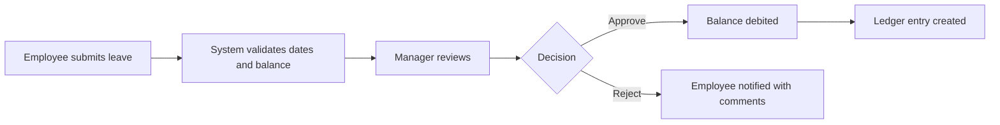
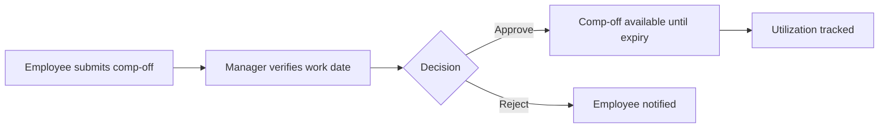
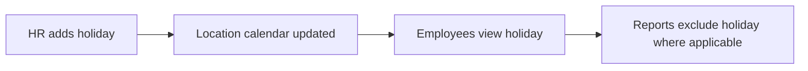

# Leave and Comp-Off Management Module

## 1. Module Purpose

The Leave and Comp-Off module manages leave types, accrual rules, balances, leave requests, approvals, leave ledger, holiday calendar, comp-off earning, expiry, and utilization tracking.

## 2. Roles and Permissions

| Role | Access |
| --- | --- |
| Super Admin | Full read/admin/override access |
| HR Admin | Configure leave types, accruals, holidays, balances, overrides, reports |
| Reporting Manager | Team leave and comp-off approvals |
| Employee | Own leave balance, leave requests, comp-off requests, holidays |
| Trainer | Own leave and comp-off requests |
| Compliance Officer | No default leave administration access |

## 3. Backend Endpoints

### Leave

| Method | Endpoint | Purpose |
| --- | --- | --- |
| GET | `/api/v1/leave/types` | Leave type list |
| POST | `/api/v1/leave/types` | Create leave type |
| GET | `/api/v1/leave/accrual-rules` | Accrual rules |
| POST | `/api/v1/leave/accrual-rules` | Create accrual rule |
| GET | `/api/v1/leave/balances` | Scoped leave balances |
| GET | `/api/v1/leave/ledger` | Scoped leave ledger |
| GET | `/api/v1/leave/requests` | Scoped leave requests |
| POST | `/api/v1/leave/requests` | Submit leave request |
| PUT | `/api/v1/leave/requests/:id` | Approve, reject, or cancel request |
| GET | `/api/v1/leave/stats` | Leave request summary |
| GET | `/api/v1/leave/holidays` | Holiday calendar |
| POST | `/api/v1/leave/holidays` | Create holiday |

### Comp-Off

| Method | Endpoint | Purpose |
| --- | --- | --- |
| GET | `/api/v1/comp-off/requests` | Scoped comp-off requests |
| POST | `/api/v1/comp-off/requests` | Submit comp-off request |
| PUT | `/api/v1/comp-off/requests/:id` | Approve/reject comp-off |
| GET | `/api/v1/comp-off/stats` | Comp-off summary |
| GET | `/api/v1/comp-off/utilizations` | Earned, utilized, available, expiry |

## 4. Leave Request Payload

```json
{
  "employeeId": 1,
  "leaveType": "Earned Leave",
  "fromDate": "2026-06-25",
  "toDate": "2026-06-27",
  "days": 3,
  "reason": "Planned family travel"
}
```

## 5. Leave Decision Payload

```json
{
  "action": "APPROVE",
  "comments": "Approved with team coverage"
}
```

## 6. Comp-Off Request Payload

```json
{
  "employeeId": 5,
  "sourceWorkDate": "2026-06-15",
  "earnedDays": 1,
  "expiresOn": "2026-09-15",
  "reason": "Weekend deployment"
}
```

## 7. Comp-Off Decision Payload

```json
{
  "action": "APPROVE",
  "comments": "Weekend deployment verified"
}
```

## 8. Workflows

### Leave Request



### Comp-Off Request



### Holiday Calendar



## 9. Validation Rules

- Leave type, from date, to date, days, and reason are required for leave requests.
- Leave `toDate` must be on or after `fromDate`.
- Leave days must be greater than zero.
- Employee must have sufficient balance unless HR Admin override is used.
- Approved leave debits balance and creates a ledger entry.
- Reject and cancel actions require comments.
- Comp-off source work date, earned days, expiry date, and reason are required.
- Comp-off expiry must be after source work date.
- Rejected comp-off requires comments.
- Employee can access only own leave/comp-off records.
- Manager can access team leave/comp-off records.
- HR Admin can access organization records.

## 10. Response Examples

### Leave Stats

```json
{
  "data": {
    "total": 3,
    "pending": 2,
    "approved": 1,
    "rejected": 0,
    "totalDaysRequested": 5
  }
}
```

### Comp-Off Stats

```json
{
  "data": {
    "total": 2,
    "pending": 1,
    "approved": 1,
    "expiringSoon": 0,
    "availableDays": 0.5
  }
}
```

## 11. UI Screens

- My Leave Dashboard
- Leave Balance Cards
- Leave Request Form
- Leave Approval Queue
- Leave Admin Dashboard
- Leave Type Master
- Accrual Rule Form
- Leave Ledger
- Holiday Calendar
- Comp-Off Request Form
- Comp-Off Approval Queue
- Comp-Off Utilization Tracker

## 12. Audit Events

- `CREATE leave_requests`
- `APPROVE leave_requests`
- `REJECT leave_requests`
- `CANCEL leave_requests`
- `CREATE leave_types`
- `CREATE leave_accrual_rules`
- `CREATE holiday_calendars`
- `CREATE comp_off_requests`
- `APPROVE comp_off_requests`
- `REJECT comp_off_requests`

## 13. Scalability Notes

- Lists are paginated.
- Leave requests filter by employee, status, and date range.
- Leave balances are scoped by employee.
- Ledger records are append-only for auditability.
- Comp-off utilization is derived from earned/utilized/expiry values.
