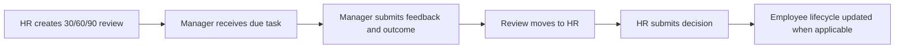
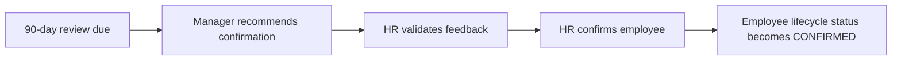
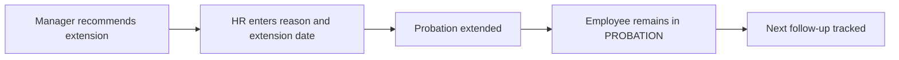

# Probation Management Module

## 1. Module Purpose

The Probation Management module tracks 30/60/90-day reviews, manager feedback, HR decisions, confirmation recommendations, extension workflows, and probation status reporting.

## 2. Roles and Permissions

| Role | Access |
| --- | --- |
| Super Admin | Full read and override access |
| HR Admin | Create reviews, make HR decisions, view reports |
| Reporting Manager | View team reviews, submit manager feedback and recommendation |
| Employee | No default access to probation management screens |
| Trainer | No access |
| Compliance Officer | No default access |

## 3. Backend Endpoints

| Method | Endpoint | Purpose |
| --- | --- | --- |
| GET | `/api/v1/probation/reviews` | Scoped probation reviews |
| POST | `/api/v1/probation/reviews` | Create probation review |
| GET | `/api/v1/probation/reviews/:id` | Review details |
| PUT | `/api/v1/probation/reviews/:id/manager-review` | Submit manager review |
| PUT | `/api/v1/probation/reviews/:id/hr-decision` | Submit HR decision |
| GET | `/api/v1/probation/stats` | Probation status summary |
| GET | `/api/v1/probation/timeline/:employeeId` | Employee probation timeline |
| GET | `/api/v1/probation/due` | Reviews due within configured days |

## 4. Create Review Payload

```json
{
  "employeeId": 47,
  "reviewDay": 30,
  "dueDate": "2026-07-20"
}
```

## 5. Manager Review Payload

```json
{
  "managerFeedback": "Good progress, needs more ownership on delivery timelines.",
  "managerRating": 4,
  "outcome": "CONTINUE"
}
```

## 6. HR Decision Payload

```json
{
  "hrFeedback": "Manager feedback accepted. Continue probation until next milestone.",
  "outcome": "CONTINUE"
}
```

Extension decision:

```json
{
  "hrFeedback": "Probation extended for skill ramp-up.",
  "outcome": "EXTEND",
  "extensionUntil": "2026-09-30"
}
```

Confirmation decision:

```json
{
  "hrFeedback": "Confirmed based on successful 90-day review.",
  "outcome": "CONFIRM",
  "confirmationDate": "2026-08-01"
}
```

## 7. Workflows

### 7.1 Standard Probation Review



### 7.2 Confirmation Workflow



### 7.3 Extension Workflow



## 8. Validation Rules

- `employeeId`, `reviewDay`, and `dueDate` are required to create a review.
- `reviewDay` must be `30`, `60`, or `90`.
- One review per employee per review day is allowed.
- Manager review requires `managerFeedback` and `outcome`.
- HR decision requires `hrFeedback` and `outcome`.
- Outcome must be `CONTINUE`, `CONFIRM`, `EXTEND`, or `TERMINATE`.
- Extension requires `extensionUntil`.
- Only HR Admin can make final HR decisions.
- Reporting Manager can submit feedback only for assigned team reviews.

## 9. Response Examples

### Probation Stats

```json
{
  "data": {
    "total": 3,
    "pendingManager": 1,
    "pendingHr": 2,
    "approved": 0,
    "overdue": 0,
    "dueIn30Days": 3,
    "confirmationRecommended": 1,
    "extensionRecommended": 0
  }
}
```

### Probation Timeline

```json
{
  "data": [
    {
      "id": 1,
      "reviewDay": 30,
      "dueDate": "2026-07-20",
      "status": "PENDING_MANAGER",
      "outcome": null
    }
  ]
}
```

## 10. UI Screens

- Probation Dashboard
- Probation Review List
- 30-Day Review Form
- 60-Day Review Form
- 90-Day Review Form
- Manager Feedback Form
- HR Decision Form
- Extension Workflow Form
- Probation Timeline
- Probation Report

## 11. Audit Events

- `CREATE probation_reviews`
- `MANAGER_REVIEW probation_reviews`
- `HR_DECISION probation_reviews`

## 12. Scalability Notes

- Reviews are paginated and filterable by status, employee, due date, and review day.
- Dashboard queries use due date and status filters.
- A unique constraint exists in the PostgreSQL schema for employee/review day.
