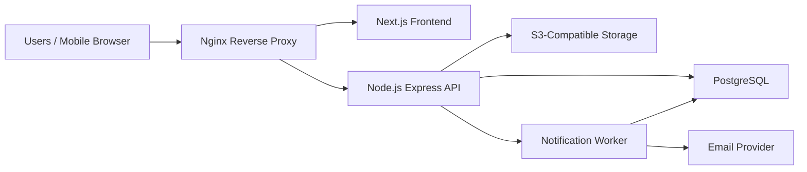
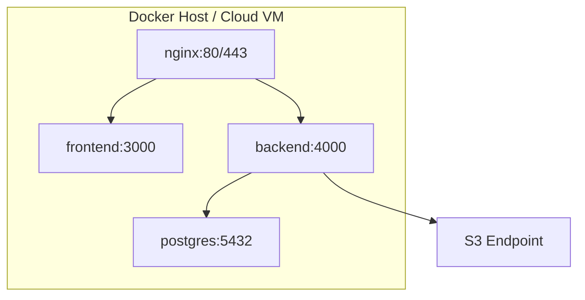

# HRMS System Architecture

## High-Level Architecture

## Application Layers

- Frontend: Next.js, TypeScript, Tailwind CSS, role-aware navigation, dashboard cards, forms, tables, filters, exports.
- Backend: Node.js, Express, JWT access tokens, refresh tokens, RBAC middleware, module routers, audit logging, notification service.
- Database: PostgreSQL schema in `backend/database/schema.sql` with lifecycle modules and workflow tables.
- Storage: S3-compatible bucket for documents, resumes, policy files, training certificates, and exit evidence.
- Deployment: Docker Compose for frontend, backend, PostgreSQL, and Nginx.

## Backend Module Boundaries

| Domain | Tables | API Prefix |
| --- | --- | --- |
| Identity & RBAC | users, refresh_tokens, roles, permissions, audit_logs | `/api/v1/auth`, `/api/v1/admin` |
| Recruitment | requisitions, candidates, interviews, offers | `/api/v1/recruitment` |
| Employee Core | employees, departments, designations, employee_job_history, employee_documents | `/api/v1/employees` |
| Attendance | shifts, shift_assignments, attendance_entries, attendance_regularizations | `/api/v1/attendance` |
| Leave & Comp-Off | leave_types, leave_accrual_rules, leave_balances, leave_requests, leave_ledger, comp_off_requests, holidays | `/api/v1/leave`, `/api/v1/comp-off` |
| Probation | probation_reviews | `/api/v1/probation` |
| Performance | performance_cycles, goals, kpis, performance_reviews | `/api/v1/performance` |
| Learning | trainings, training_sessions, training_assignments, training_attendance, certificates | `/api/v1/learning` |
| Policy & Compliance | policies, policy_versions, policy_assignments, policy_acknowledgements, compliance_tasks, employee_certifications | `/api/v1/policies`, `/api/v1/compliance` |
| Exit | resignations, exit_checklists, asset_recoveries, knowledge_transfers, fnf_settlements | `/api/v1/exits` |
| Notifications | notifications, email_queue | `/api/v1/notifications` |

## Security

- Access token expiry: 15 minutes.
- Refresh token expiry: 7 days with rotation.
- Refresh tokens are hashed before storage.
- Passwords are hashed with bcrypt.
- RBAC is enforced in middleware and reflected in frontend navigation.
- Every approval and admin mutation writes to `audit_logs`.
- File upload APIs validate MIME type, size, owner, and module context.

## Scalability

- Stateless API containers can be horizontally scaled.
- PostgreSQL connection pooling is used through `pg`.
- Expensive report queries should be indexed and paginated.
- Notification delivery is decoupled through `email_queue`.
- S3 object storage avoids storing binary files in the database.

## Deployment Topology

