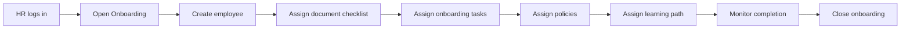
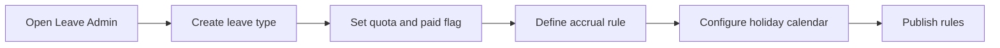
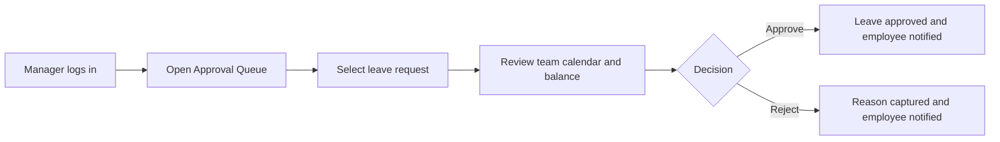
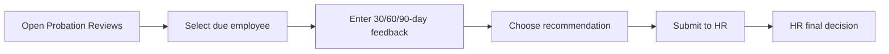
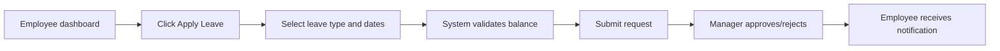
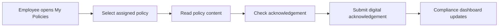
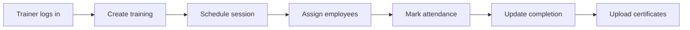
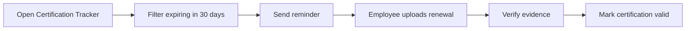
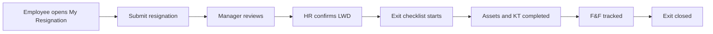

# HRMS UI Screens, Workflows, and User Journeys

This document defines the complete role-based UI screens and workflows for the HRMS. It is aligned with `docs/BRD_FUNCTIONAL_REQUIREMENTS.md`, `docs/PROJECT_MEMORY.md`, and `docs/API_DESIGN.md`.

## 1. UI Design Principles

- Role-first experience: each role sees only relevant dashboards, navigation, actions, and data.
- Workflow-first screens: every actionable module shows status, owner, due date, comments, and next action.
- Mobile responsive: desktop tables become mobile cards; approval actions stay easy to reach.
- Searchable by default: all list screens support search, filters, sorting, and pagination.
- Compliance-safe: sensitive fields are hidden or masked based on role.
- Audit-friendly: approval and workflow detail screens show timeline and comments.
- No duplicate functionality: shared approval, notification, export, and audit components are reused.

## 2. Global Application Layout

### 2.1 Desktop Layout

```text
+-----------------------------------------------------------------------------------+
| Top Bar: Global Search | Notifications | Role/Profile | Quick Actions             |
+----------------------+------------------------------------------------------------+
| Sidebar Navigation   | Page Header: Title, Breadcrumb, Primary CTA                |
| - Dashboard          +------------------------------------------------------------+
| - Role Modules       | KPI Cards / Filters / Data Table / Detail Drawer           |
| - Reports            | Workflow Timeline / Comments / Approval Actions            |
| - Settings           |                                                            |
+----------------------+------------------------------------------------------------+
```

### 2.2 Tablet Layout

```text
+------------------------------------------------------------------+
| Top Bar: Menu | Search | Notifications | Profile                 |
+------------------------------------------------------------------+
| Collapsible Sidebar / Drawer                                      |
+------------------------------------------------------------------+
| Stacked KPI Cards                                                 |
| Responsive Tables with horizontal scroll or card mode             |
+------------------------------------------------------------------+
```

### 2.3 Mobile Layout

```text
+--------------------------------------------------+
| Header: Menu | Page Title | Notifications         |
+--------------------------------------------------+
| Search / Filter Chips                             |
+--------------------------------------------------+
| KPI Cards stacked vertically                      |
| List Cards instead of tables                      |
| Sticky bottom primary action / approval buttons   |
+--------------------------------------------------+
| Bottom Nav: Home | Requests | Approvals | Profile |
+--------------------------------------------------+
```

## 3. Global Navigation

### 3.1 HR Navigation

- HR Dashboard
- Recruitment
- Onboarding
- Employee Master
- Departments
- Designations
- Attendance
- Leave
- Comp-Off
- Probation
- Performance
- Learning
- Policies
- Certifications
- Compliance
- Exit Management
- Reports
- Notifications
- Audit Logs
- Settings

### 3.2 Manager Navigation

- Manager Dashboard
- Team Directory
- Team Attendance
- Team Leave
- Approval Queue
- Probation Reviews
- Team Performance
- Team Training
- Team Policy Compliance
- Exit Reviews
- Team Reports

### 3.3 Employee Navigation

- Employee Dashboard
- My Profile
- My Attendance
- My Leave
- My Comp-Off
- My Trainings
- My Policies
- My Documents
- My Certifications
- My Requests
- My Resignation
- Notifications

### 3.4 Trainer Navigation

- Trainer Dashboard
- Training Calendar
- Training Sessions
- Attendance Marking
- Completion Tracking
- Certificates
- Training Reports
- Notifications

### 3.5 Compliance Officer Navigation

- Compliance Dashboard
- Policy Repository
- Policy Assignments
- Policy Acknowledgements
- Certification Tracker
- Compliance Tasks
- Evidence Repository
- Compliance Reports
- Notifications

## 4. Dashboard Layouts

## 4.1 HR Dashboard

### Desktop Wireframe

```text
+ HR Dashboard ----------------------------------------------------------------------+
| KPI: Headcount | KPI: Attrition | KPI: New Joiners | KPI: Pending Approvals       |
+-----------------------------------------------------------------------------------+
| Attendance Analytics Chart        | Leave Analytics Chart                          |
+-----------------------------------------------------------------------------------+
| Probation Status                  | Training Compliance                            |
+-----------------------------------------------------------------------------------+
| Policy Compliance                 | Expiry Alerts / Overdue Actions                |
+-----------------------------------------------------------------------------------+
| Recent Joiners Table              | Approval Queue                                 |
+-----------------------------------------------------------------------------------+
```

### Widgets

- Headcount by department, location, employee status.
- Attrition rate and exited employees.
- New joiners and onboarding completion.
- Attendance summary: present, WFH, absent, missing checkout.
- Leave summary: pending, approved, balance risk.
- Probation due within 30 days.
- Mandatory training completion percentage.
- Policy acknowledgement pending and overdue count.
- Certification/document expiry alerts.
- Pending approval queue.

### Primary Actions

- Add Employee
- Create Requisition
- Assign Policy
- Create Training
- Export Report

## 4.2 Manager Dashboard

```text
+ Manager Dashboard -----------------------------------------------------------------+
| Team Headcount | Pending Approvals | Attendance Gaps | Probation Due              |
+-----------------------------------------------------------------------------------+
| Team Attendance Calendar             | Team Leave Calendar                         |
+-----------------------------------------------------------------------------------+
| Approval Queue: Leave / Attendance / Comp-Off / Probation / Exit                  |
+-----------------------------------------------------------------------------------+
| Team Training Compliance             | Team Performance Snapshot                    |
+-----------------------------------------------------------------------------------+
```

### Widgets

- Direct report count.
- Team attendance status.
- Team leave calendar.
- Pending leave, attendance, comp-off approvals.
- Probation reviews due.
- Training and policy compliance gaps.
- Team performance review status.

### Primary Actions

- Approve / Reject Request
- Submit Probation Review
- Add Manager Feedback
- View Team Report

## 4.3 Employee Dashboard

```text
+ Employee Dashboard ----------------------------------------------------------------+
| Today Attendance | Leave Balance | Pending Requests | Policy Acks Due            |
+-----------------------------------------------------------------------------------+
| Quick Actions: Check In / Check Out / Apply Leave / Upload Document               |
+-----------------------------------------------------------------------------------+
| My Requests Timeline                 | Assigned Trainings                          |
+-----------------------------------------------------------------------------------+
| My Policies                          | Documents and Certifications                 |
+-----------------------------------------------------------------------------------+
```

### Widgets

- Today check-in/check-out status.
- Leave balances for CL, SL, EL, Comp-Off.
- Pending requests and approval status.
- Assigned training and due dates.
- Policy acknowledgements due.
- Documents/certifications expiring.

### Primary Actions

- Check In
- Check Out
- Apply Leave
- Request Comp-Off
- Regularize Attendance
- Upload Document
- Acknowledge Policy

## 4.4 Trainer Dashboard

```text
+ Trainer Dashboard -----------------------------------------------------------------+
| Upcoming Sessions | Attendance Pending | Completion Rate | Certificates Pending     |
+-----------------------------------------------------------------------------------+
| Training Calendar                    | Session Attendance Queue                     |
+-----------------------------------------------------------------------------------+
| Training Assignments                 | Completion and Certificate Tracker           |
+-----------------------------------------------------------------------------------+
```

### Widgets

- Upcoming training sessions.
- Attendance marking pending.
- Training completion percentage.
- Certificate issuance pending.
- Department-wise training progress.

### Primary Actions

- Create Training
- Schedule Session
- Mark Attendance
- Upload Certificate
- Export Training Report

## 4.5 Compliance Officer Dashboard

```text
+ Compliance Dashboard --------------------------------------------------------------+
| Policy Pending | Policy Overdue | Certifications Expiring | Compliance Tasks Due    |
+-----------------------------------------------------------------------------------+
| Policy Acknowledgement Heatmap       | Certification Expiry Timeline                |
+-----------------------------------------------------------------------------------+
| Compliance Task Board                | Evidence Upload Status                       |
+-----------------------------------------------------------------------------------+
```

### Widgets

- Policy acknowledgement completion.
- Overdue policy acknowledgements.
- Certifications expiring in 90/60/30/15/7 days.
- Compliance task status.
- Evidence pending.
- Department-wise compliance risk.

### Primary Actions

- Publish Policy
- Assign Policy
- Verify Certification
- Create Compliance Task
- Export Compliance Report

## 5. Screen Catalog

### 5.1 Authentication Screens

| Screen | Fields / Components | Actions |
| --- | --- | --- |
| Login | Email, password, remember device, demo role helper | Login |
| Forgot Password | Email | Send reset link |
| Reset Password | New password, confirm password | Reset |
| Session Expired | Message, login CTA | Return to login |

### 5.2 Recruitment Screens

| Screen | Users | Components | Actions |
| --- | --- | --- | --- |
| Requisition List | HR, Manager | Search, department filter, status filter, table/cards | Create, view, edit, export |
| Requisition Form | HR, Manager | Title, department, designation, openings, hiring manager, target date | Save draft, submit |
| Candidate List | HR, Manager | Search, stage filter, rating, requisition | Add, view, move stage |
| Candidate Form | HR | Name, email, phone, source, resume upload, stage | Save, upload resume |
| Interview Scheduler | HR, Manager | Candidate, round, interviewer, date/time, meeting link | Schedule |
| Interview Feedback | Manager | Score, feedback, recommendation | Submit feedback |
| Offer Form | HR | Candidate, CTC, joining date, terms, approval status | Generate, submit approval |

### 5.3 Onboarding Screens

| Screen | Users | Components | Actions |
| --- | --- | --- | --- |
| Onboarding Dashboard | HR | Active joiners, overdue tasks, completion chart | View joiner |
| New Joiner Profile | HR, Manager, Employee | Employee info, task checklist, documents, policies, learning | Update status |
| Onboarding Task Form | HR | Task name, type, owner role, due date | Assign |
| Document Checklist | HR, Employee | Required docs, upload status, expiry | Upload, verify |
| Policy Assignment | HR, Compliance | Policy version, target audience, due date | Assign |
| Learning Path Assignment | HR, Trainer | Training list, due dates | Assign |

### 5.4 Employee Management Screens

| Screen | Users | Components | Actions |
| --- | --- | --- | --- |
| Employee Directory | HR, Manager, Employee | Search, filters, employee cards/table | View profile |
| Employee Master List | HR | Advanced filters, export, status | Add, edit, soft delete |
| Employee Profile | HR, Manager, Employee | Personal, job, manager, documents, leave, attendance, history | Edit based on role |
| Employee Form | HR | Personal info, contact, job, reporting, compensation, bank metadata | Save |
| Department Master | HR | Department code, name, parent, active flag | Add/edit |
| Designation Master | HR | Title, department, level, active flag | Add/edit |
| Org Chart | HR, Manager, Employee | Hierarchy tree | Expand/collapse |
| Job History | HR | Effective dates, department, designation, manager | Add transfer/promotion |

### 5.5 Attendance Screens

| Screen | Users | Components | Actions |
| --- | --- | --- | --- |
| My Attendance | Employee | Today card, check-in/out, monthly calendar | Check in, check out, regularize |
| Team Attendance | Manager | Team status, exceptions, calendar | Approve regularization |
| Attendance Admin | HR | Organization attendance table, filters | Correct, export |
| Shift Master | HR | Shift name, start, end, grace | Add/edit shift |
| Shift Assignment | HR | Employee, shift, effective dates | Assign |
| Regularization Form | Employee | Date, requested check-in/out, reason | Submit |
| Regularization Approval | Manager | Request details, old/new times, comments | Approve/reject |

### 5.6 Leave and Comp-Off Screens

| Screen | Users | Components | Actions |
| --- | --- | --- | --- |
| My Leave | Employee | Balance cards, leave history, calendar | Apply leave |
| Leave Request Form | Employee | Leave type, dates, half/full day, reason, attachment | Submit |
| Leave Approval | Manager | Request details, balance, team calendar, comments | Approve/reject |
| Leave Admin | HR | All requests, balances, filters | Override, export |
| Leave Type Master | HR | Code, name, quota, paid flag, document required | Add/edit |
| Accrual Rule Form | HR | Leave type, frequency, amount, carry forward, effective dates | Save |
| Holiday Calendar | HR, Employee | Location, holiday date, optional flag | Add/edit/view |
| Comp-Off Request Form | Employee | Work date, earned days, reason | Submit |
| Comp-Off Approval | Manager | Source date, reason, expiry | Approve/reject |
| Comp-Off Ledger | HR, Employee | Earned, utilized, expired, balance | View/export |

### 5.7 Probation Screens

| Screen | Users | Components | Actions |
| --- | --- | --- | --- |
| Probation Dashboard | HR, Manager | Due reviews, overdue, outcome summary | View review |
| 30/60/90 Review Form | Manager | Ratings, strengths, concerns, recommendation | Submit |
| HR Probation Decision | HR | Manager feedback, history, outcome, extension date | Confirm/extend/continue/terminate |
| Probation Timeline | HR, Manager | 30/60/90 milestones, comments, status | View |

### 5.8 Performance Screens

| Screen | Users | Components | Actions |
| --- | --- | --- | --- |
| Performance Dashboard | HR, Manager | Cycle status, pending reviews, ratings | View |
| Cycle Setup | HR | Name, dates, eligible employees | Create cycle |
| Goals Page | Employee, Manager | Goal list, weight, KPI mapping | Add/edit goals |
| KPI Form | Employee, Manager | Metric, target, actual, score | Save |
| Self Review | Employee | Comments, achievements, blockers | Submit |
| Manager Review | Manager | Feedback, rating, final comments | Submit |
| Annual Assessment | HR | Calibration view, final ratings | Close cycle |

### 5.9 Learning Screens

| Screen | Users | Components | Actions |
| --- | --- | --- | --- |
| Training Calendar | HR, Trainer, Employee | Calendar/list view, filters | View/register |
| Training Form | HR, Trainer | Title, category, mandatory, audience | Create |
| Session Form | Trainer | Trainer, start/end, location, meeting URL | Schedule |
| Assignment Screen | HR, Trainer | Employee/department/designation audience | Assign |
| Attendance Marking | Trainer | Participant list, attended flag | Mark attendance |
| Completion Tracker | HR, Trainer, Manager | Assignment status, completion dates | Update/export |
| Certificate Upload | Trainer, Employee | Certificate file, issued/expiry dates | Upload |

### 5.10 Policy and Compliance Screens

| Screen | Users | Components | Actions |
| --- | --- | --- | --- |
| Policy Repository | HR, Compliance, Employee | Policy list, category, version, status | View/create |
| Policy Form | HR, Compliance | Name, category, owner | Save |
| Policy Version Form | HR, Compliance | Version, effective date, review date, expiry, file/body | Publish |
| Policy Assignment | HR, Compliance | Version, employees/departments/designations, due date | Assign |
| Policy Reader | Employee | Version metadata, content/PDF, acknowledgement checkbox | Acknowledge |
| Acknowledgement Dashboard | HR, Compliance, Manager | Pending, completed, overdue | Remind/export |
| Certification Tracker | HR, Compliance, Employee | Certification list, expiry, evidence | Add/verify |
| Compliance Task Board | Compliance | Tasks by status and due date | Create/update |
| Evidence Upload | Compliance | Evidence file, notes, task | Upload |

### 5.11 Exit Management Screens

| Screen | Users | Components | Actions |
| --- | --- | --- | --- |
| Resignation Form | Employee, HR | Resignation date, requested LWD, reason | Submit |
| Manager Exit Review | Manager | Notice period, KT requirement, comments | Approve/reject |
| HR Exit Case | HR | LWD, checklist, assets, KT, F&F | Process |
| Exit Checklist | HR, Manager | Item, owner, due date, status | Update |
| Asset Recovery | HR | Asset, serial number, recovered date | Mark recovered |
| Knowledge Transfer | Manager | Topic, recipient, notes, status | Mark complete |
| F&F Tracking | HR | Payroll status, settlement amount, paid date | Close |

### 5.12 Reports Screens

| Screen | Users | Components | Actions |
| --- | --- | --- | --- |
| Report Center | HR, Manager, Compliance, Trainer | Report cards, access by role | Open report |
| Attendance Report | HR, Manager | Date, employee, department, mode, status | Filter/export |
| Leave Report | HR, Manager | Leave type, date range, status | Filter/export |
| Headcount Report | HR | Department, location, status | Export |
| Attrition Report | HR | Date range, department, reason | Export |
| Probation Report | HR, Manager | Due date, outcome, status | Export |
| Training Report | HR, Trainer, Manager | Training, department, completion | Export |
| Policy Compliance Report | HR, Compliance, Manager | Policy, department, status | Export |
| Certification Report | HR, Compliance | Expiry range, issuer, status | Export |

## 6. Form Specifications

### 6.1 Common Form Behavior

- Required fields are marked with `*`.
- Unsaved changes show confirmation before navigation.
- Submit buttons are disabled during save.
- Validation errors appear inline and in summary.
- Audit-sensitive forms require comments on reject, override, send-back, and cancellation.
- File forms validate file type, size, and module ownership.

### 6.2 Critical Forms and Fields

| Form | Required Fields |
| --- | --- |
| Employee Form | Full name, employee code, joining date, department, designation, manager, location, lifecycle status |
| Candidate Form | Full name, email or phone, stage |
| Requisition Form | Title, department, openings, hiring manager |
| Offer Form | Candidate, offered CTC, joining date, status |
| Leave Request | Leave type, from date, to date, days, reason |
| Attendance Regularization | Date, requested check-in/out, reason |
| Comp-Off Request | Source work date, earned days, reason |
| Probation Review | Review day, feedback, recommendation |
| Goal Form | Cycle, title, weight |
| Training Form | Title, category, mandatory flag, audience |
| Policy Version | Policy, version number, effective date, review date |
| Policy Acknowledgement | Acceptance checkbox |
| Certification Form | Certification name, issuer, issued date, expiry date |
| Resignation Form | Resignation date, requested last working day, reason |

## 7. Approval Workflow Screens

### 7.1 Shared Approval Detail Layout

```text
+ Approval Detail -------------------------------------------------------------------+
| Header: Entity Type | Employee | Status | Submitted Date                           |
+-----------------------------------------------------------------------------------+
| Request Details                                                                    |
+-----------------------------------------------------------------------------------+
| Supporting Information: balances, documents, policy, history, team calendar         |
+-----------------------------------------------------------------------------------+
| Timeline: Submitted -> Reviewed -> Approved/Rejected/Closed                        |
+-----------------------------------------------------------------------------------+
| Comments                                                                           |
+-----------------------------------------------------------------------------------+
| Sticky Actions: Approve | Reject | Send Back | Override                            |
+-----------------------------------------------------------------------------------+
```

### 7.2 Approval Rules by Role

| Workflow | HR | Manager | Employee | Trainer | Compliance Officer |
| --- | --- | --- | --- | --- | --- |
| Leave | Override/View | Approve team | Submit/cancel own | Submit own | No |
| Attendance Regularization | Override/View | Approve team | Submit own | Submit own | No |
| Comp-Off | Override/View | Approve team | Submit own | Submit own | No |
| Probation | Final decision | Submit feedback | No | No | No |
| Performance | Configure/close | Review team | Self-review | No | No |
| Training | Configure | View team compliance | Attend | Manage sessions | View compliance |
| Policy | Assign/manage | View team compliance | Acknowledge | Acknowledge | Manage/verify |
| Certification | Verify/view | View team | Upload own | Upload own | Verify/manage |
| Exit | Final closure | Review team exit | Submit own | No | Compliance view |

## 8. Mobile Views

### 8.1 Mobile Navigation

```text
+ Header ------------------------------------------+
| Menu | Page Title | Bell                         |
+--------------------------------------------------+
| Search bar / Filter chips                        |
+--------------------------------------------------+
| Content cards                                    |
+--------------------------------------------------+
| Bottom Nav: Home | Requests | Approvals | Profile|
+--------------------------------------------------+
```

### 8.2 Mobile Dashboard Rules

- KPI cards stack in one column.
- Charts become compact summary cards.
- Tables become cards with primary fields and expandable details.
- Filters appear as chips and bottom-sheet filter panel.
- Approval actions remain sticky at bottom.
- Long forms use sections with progress indicators.

### 8.3 Mobile Card Examples

```text
+ Leave Request Card ------------------------------+
| Aakansha Yadav                                   |
| Earned Leave | 25 Jun - 27 Jun | 3 days          |
| Status: PENDING_MANAGER                          |
| [View] [Approve] [Reject]                        |
+--------------------------------------------------+
```

```text
+ Policy Card -------------------------------------+
| Information Security Policy v1.3                 |
| Due: 30 Jun 2026 | Status: Pending               |
| [Read & Acknowledge]                             |
+--------------------------------------------------+
```

## 9. User Journeys

### 9.1 HR: Create Employee and Complete Onboarding



### 9.2 HR: Configure Leave Policy



### 9.3 Manager: Approve Leave



### 9.4 Manager: Complete Probation Review



### 9.5 Employee: Apply Leave



### 9.6 Employee: Acknowledge Policy



### 9.7 Trainer: Run Training Session



### 9.8 Compliance Officer: Track Certification Expiry



### 9.9 Employee: Resignation and Exit



## 10. Screen-to-API Mapping

| UI Area | API Prefix |
| --- | --- |
| Login / Session | `/api/v1/auth` |
| HR Dashboard | `/api/v1/dashboard` |
| Recruitment | `/api/v1/recruitment/*` |
| Onboarding | `/api/v1/onboarding/tasks` |
| Employee Master | `/api/v1/employees` |
| Attendance | `/api/v1/attendance/*` |
| Leave | `/api/v1/leave/*` |
| Comp-Off | `/api/v1/comp-off/requests` |
| Probation | `/api/v1/probation/reviews` |
| Performance | `/api/v1/performance/*` |
| Learning | `/api/v1/learning/*` |
| Policies | `/api/v1/policies/*` |
| Compliance | `/api/v1/compliance/*` |
| Exit | `/api/v1/exits/*` |
| Reports | `/api/v1/reports/:reportKey` |
| Notifications | `/api/v1/notifications` |

## 11. UI Acceptance Criteria

- HR, Manager, Employee, Trainer, and Compliance Officer each have distinct role navigation.
- Each role has a dashboard with KPIs, alerts, and actionable queues.
- All major workflows have list, detail, form, timeline, and approval states.
- Mobile layout supports bottom navigation, stacked cards, card lists, and sticky actions.
- Employee-facing requests show status and comments.
- Manager approval screens show team context before approval.
- Compliance screens show policy, certification, task, and evidence status.
- Forms validate required fields and show inline errors.
- Export actions are available on report/list screens according to role permissions.
- UI does not expose modules or actions not allowed for the logged-in role.
